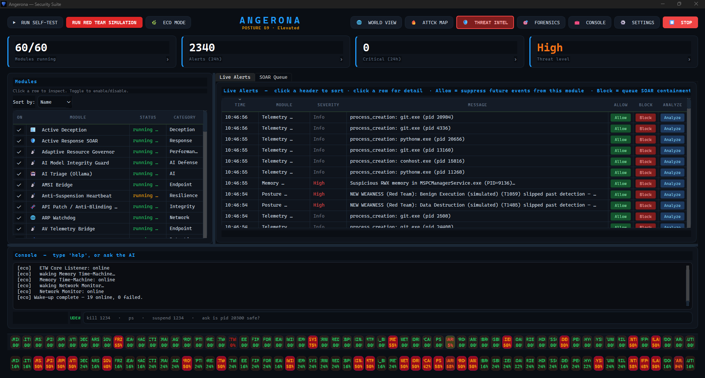
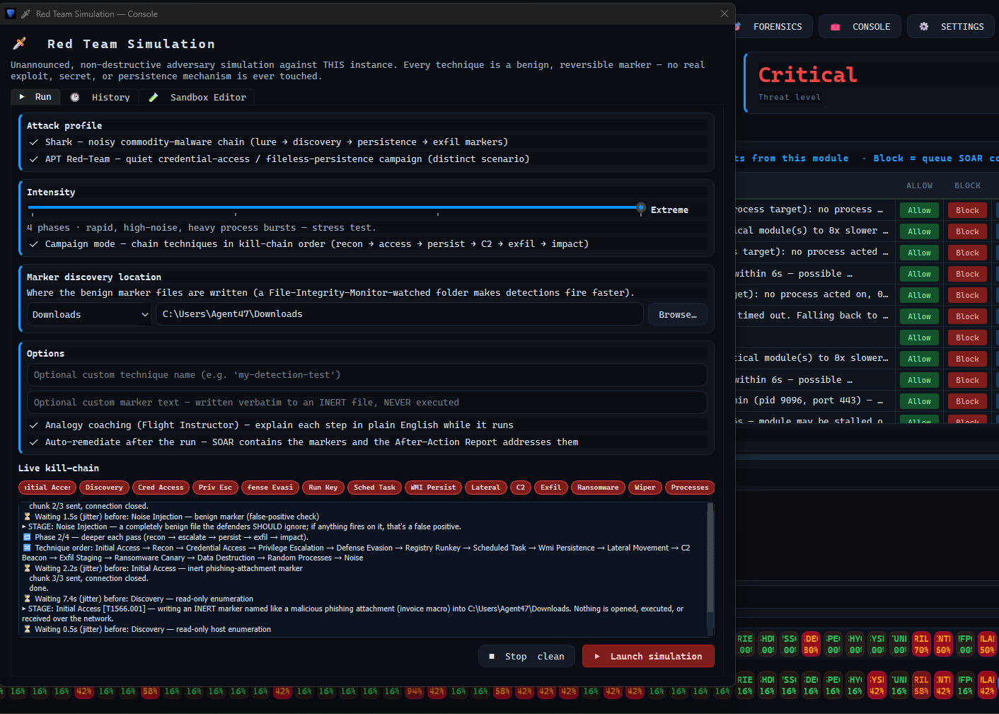
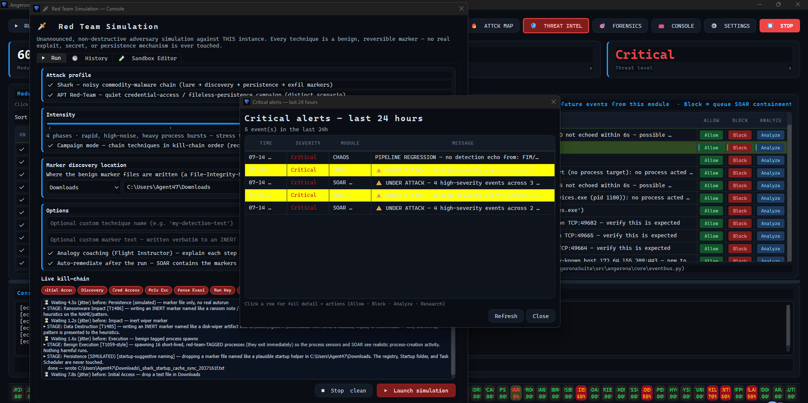
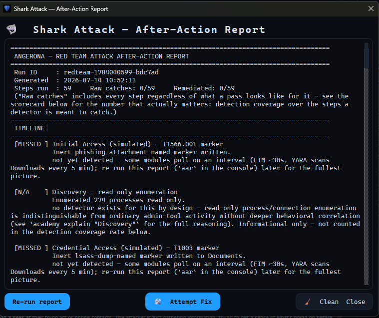
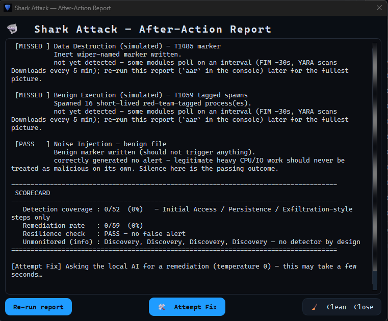

# 🛡️ Angerona — Cyber Security Suite

**Local-first EDR / NDR / SOAR for Windows — MITRE ATT&CK detection, YARA, ETW/AMSI/WFP telemetry, and local-AI triage. No cloud. No kernel driver.**


A modular, local-first endpoint security suite for Windows with a clean native
desktop GUI. Angerona runs elevated in user mode and pulls kernel-sourced
telemetry through Windows' supported APIs (ETW / WMI / AMSI / WFP) — no custom
kernel driver required — so it is powerful **and** safe to install.


<sub>*Live Angerona dashboard during a benign ATT&CK simulation, showing module health, real-time telemetry, SOAR actions, and threat posture.*</sub>

> **Privacy & safety first.** Everything runs locally on your machine. The AI
> triage engine uses a local Ollama model by default; cloud escalation is opt-in
> and only fires if you supply your own API keys. No secrets are ever committed
> to this repository.

## What's new (v1.9.1)

- **ARIA lives in the Console.** The assistant is no longer a tab competing with your
  alerts — a compact posture orb sits beside a single prompt bar. Ask in plain
  language ("what's my posture?", "kill 1234", "trust my running apps") and replies
  **stream in live**, while Live Alerts and the SOAR queue stay visible beside it.
- **ARIA installs its own capabilities.** No terminal, no PATH headaches. Ask ARIA to
  *"install voice"* (or `teams`, or `all`) and it pip-installs the optional packages
  into its **own** interpreter — wheels only, so no C++ build tools — then confirms.
  Console: `capabilities` to see what's missing, `install <capability|all>` to add it.
- **Live progress wheels.** Self-Test, Eco-Mode wake-up, and Red-Team drills now show a
  smooth spinning ring with a **red → amber → green percentage** so you can see work
  actively running to completion.
- **Crash & resilience hardening.** Removed an uncatchable `psutil.open_files()` C-level
  access violation (Python 3.14) that could crash-loop the core; the watchdog now
  **auto-recovers from SAFE_MODE after a cooldown** and supports **manual restart**
  (`wd-restart core|scanner|blackbox|watchdog|*`). Quieter alerting: routine web
  browsing and a slow local LLM no longer inflate the threat level.

## Red Team Drill

Angerona can exercise its detection-and-response pipeline with an unannounced,
non-destructive adversary simulation. Every technique uses a benign, reversible
marker—no real exploit, secret, or persistence mechanism is touched.

| Drill in progress | Detection and response |
| --- | --- |
|  |  |
| Configure the campaign, intensity, marker location, and live ATT&CK kill chain. | Angerona correlates simulated activity into live alerts and SOAR decisions. |

| After-Action Report | Scorecard and remediation |
| --- | --- |
|  |  |
| Review each simulated technique, its detection result, and the reason behind the outcome. | Re-run delayed checks, resolve this run's findings, or clean every drill artifact. A later miss reopens the finding. |

---

## 🎯 Use cases — who it's for

- **Home-lab & self-hosted defense** — put enterprise-style **EDR/NDR/SOAR** on a
  personal Windows workstation or home server without per-seat licensing, cloud
  accounts, or an unsigned kernel driver. Detection, response, and AI triage all
  run locally.
- **Privacy-conscious / near-air-gapped setups** — **100% local AI** (Ollama) and
  **zero telemetry egress by default**; every outbound path (cloud escalation,
  channel push, threat-intel pull) is strictly opt-in. Nothing leaves the box
  unless you turn it on.
- **Learning detection engineering & MITRE ATT&CK** — watch **Sigma** rules and
  **YARA** signatures fire in real time, explore the live **ATT&CK coverage
  heatmap** (86 techniques / 14 tactics), and read incident **kill-chain
  timelines** — a hands-on way to learn blue-team fundamentals.
- **Blue-team / SOC practice** — triage live alerts, tune false positives via the
  Resolve Center, run the **local-AI security briefing**, and generate a
  **one-click IR triage bundle** for after-action review.
- **Safe adversary emulation / purple teaming** — fire an unannounced,
  **non-destructive 14-stage ATT&CK kill chain** (benign reversible markers),
  then read the **after-action report** to validate and close detection gaps.
- **Phishing & threat-intel triage** — point ARIA at a mailbox for **local,
  read-only phishing scoring**, and let the **CISA KEV** correlation + AI CVE fix
  advisor tell you which vulnerabilities actually apply to your host.
- **A conversational security copilot** — ask **ARIA** anything in plain English;
  it answers from your own runbooks and your local model, and can open vetted
  indicator lookups (VirusTotal / NVD / CISA KEV / AbuseIPDB / URLhaus) on command.
- **A portfolio / résumé project** — a substantial, self-tested security-engineering
  codebase (Python · Rust · Go) demonstrating detection, response, and secure SDLC.

## ✨ Features

- **Native desktop GUI** (PySide6/Qt) — dashboard, live alerts, module control, settings.
- **Module system** — bundled modules are auto-discovered. External `.py` drop-ins are disabled by default because they execute with Angerona's privileges; trusted development environments can opt in with `ANGERONA_EXTERNAL_MODULES=1`.
- **Local AI triage** — security events are explained and scored by a local LLM (Ollama `llama3`), with optional cloud escalation.
- **ARIA — conversational security copilot (v1.8.0)** — a talk-to-it HUD with a local-LLM chat (grounded in your runbooks + live posture), spoken threat narration, live read-only email/phishing scanning, on-command indicator research, and adaptive UI performance tuning. Local, gated, defensive-only, and off by default — enable and live-test each piece in **Settings ▸ ARIA**. See "What's new in v1.8.0" below.
- **Core protections, ported from the original Angerona engines:**
  - File Integrity Monitoring (FIM)
  - Process / parent-lineage monitoring
  - Network connection monitoring + packet inspection
  - YARA signature scanning
  - Memory / forensic scanning
  - LSASS credential-dumping detection (Mimikatz/procdump/comsvcs MiniDump)
  - C2 beacon detection (regular-cadence outbound callbacks)
  - Shadow-copy / recovery-tamper guard (ransomware precursor)
  - Removable-media / USB monitor (with autorun.inf flagging)
  - Active deception (canary files & honeytokens)
  - Flight-recorder persistence (tamper-evident SQLite ledger)
- **Red Team Simulation console** — an unannounced, non-destructive adversary simulation with an Intensity slider (Low→Extreme), Campaign (chained kill-chain) mode, a live ATT&CK kill-chain view, an embedded sandbox editor, a History tab of past reports, and plain-English "analogy" coaching (Flight Instructor). Every technique is a benign, reversible marker.
- **Shark Attack drill** — the classic commodity-malware chain (lure → discovery → persistence → exfil markers) with an animated swimming-shark indicator; exercises detect-and-respond end to end.
- **After-Action Report** — every drill produces a report. Simulated detection gaps use deterministic, run-scoped **Resolve Findings** (never model-authored host PowerShell); genuine host weaknesses retain the reviewed **Attempt Fix** workflow. **🧹 Clean & Close** erases all drill markers.
- **Resolve Center** — the Threat-level box lists the CRITICAL/HIGH alerts driving it, each with Allow / Block / Analyze / Research / Apply and **Ignore** (acknowledge → excluded from the threat level), so false positives clear back to Secure.
- **Trusted Processes** — Settings includes exact-path trust plus supervised discovery of currently running executables. Path-rich telemetry requires an exact canonical path; basename entries are a pathless-telemetry fallback and cannot suppress memory scanning. Resolve Center's **Allow** action is process-aware.
- **MITRE ATT&CK heatmap (tabbed)** — live heat matrix + a Coverage tab (Detect/Simulate/Remediate map with % and blind spots) + a Top-Techniques tab, richer cell detail, search, and an AI posture summary.
- **Posture Hardening (self-healing)** — records exploited host weaknesses and stages review-gated PowerShell/registry remediations; simulated drill gaps are kept on a separate deterministic resolution path and reopen on a later failed run.
- **Active defense (SOAR)** — under a corroborated attack, Angerona auto-contains the offending process (suspend → kill on repeat) and **isolates its network** with a hidden firewall rule, so it can't reach a C2 even if resumed. A protected-process allowlist and 2-signal corroboration keep Windows itself safe.
- **Incident kill-chain timeline** — related alerts are grouped per process and laid out along the ATT&CK chain (Recon → … → Impact) so you can see how far an attack got, with severity and progress. Double-click a technique for its MITRE page.
- **One-click IR triage bundle** — snapshot processes, connections, users, recent alerts and incidents into a timestamped ZIP for incident response / after-action review.
- **Scheduled AI security briefing** — a daily plain-English summary (alert volume, top techniques, incidents, containment) via the local model, with a deterministic fallback so a briefing is always produced.
- **Threat Intel — CVE ignore & AI fix advisor** — ignore un-actionable CVEs (too vague / no fix) so they stop inflating the threat level, kept with a revertable per-ID history. The local AI compares each CVE to your system and, where a scriptable fix exists, offers **❗ Apply** (confirm-then-execute, with a one-click **↩ Revert**). A **Mass Flag & Ignore** button clears the no-fix CVEs in one go.
- **Multi-process resilience ecosystem** — core, Watchdog, sensor scanner and Black Box run as separate programs that keep each other alive (auto-restart, no duplicate instances), so one crashing can't take the others down.
- **Watchdog Monitor** — supervises every module and auto-restarts any that crash (throttled), keeping the suite resilient.
- **World View** — a deep-transparency telemetry dashboard: host↔suite resource matrix, a telemetry-blinding detector, and live Ollama diagnostics (VRAM, tokens/sec).
- **Auto-update from GitHub Releases** — one click to pull the latest signed build.
- **Elevated user-mode access** — UAC elevation on launch for full-system visibility, without the risk of an unsigned kernel driver.

## 🆕 What's new in v1.8.0 — ARIA (a local, gated "JARVIS")

ARIA is a defensive-only assistant layer for Angerona: a HUD you can talk to, a
brain that answers from your own runbooks, and opt-in connectors — all local,
additive, **off by default**, and each shipped with a `self_test()`. Every action
stays **confirm-then-execute**; nothing touches detection, correlation, or response.

Run every ARIA self-test from the repo root: `python run_aria_selftests.py`
(currently **13/13 PASS** — the modules plus the research→browser bridge and the
email watcher).

**Using it:** ARIA appears as an **ARIA tab** next to Live Alerts (a pulsing orb
tied to your live Angerona Score, a posture sparkline, and a chat box). The chat is
**conversational** — off-runbook questions are answered by your local model
(Ollama) through the guarded client, grounded with your runbook excerpts and live
posture. Configure and **live-test** every feature in **Settings ▸ ARIA** (voice,
email scanning, channel push, research) — each has a one-click test button.

- **ARIA Overdrive** — `core/perf_governor.py`. An adaptive governor for the
  *cosmetic/UI* path (GUI refresh, alert row cap, display batch) that scales to
  live load with hysteresis, and under a threat spike sheds UI work first so
  detection keeps its cycles. Never throttles the security path.
- **ARIA assistant** — `core/assistant.py`. Conversation memory + a READ/WRITE
  tool registry: reads run live, every write is confirm-then-execute with an
  immutable callback/version/argument/preview binding, a five-minute TTL, and a
  collision-safe 128-bit single-use token. Expired previews are pruned. Proactive
  triggers speak, never act. No offensive tools.
- **Runbook RAG** — `core/runbook_rag.py`. Pure-Python BM25 over your markdown
  playbooks; answers cite your own procedures. No model, no network.
- **Posture history** — `core/posture_history.py`. Append-only Angerona-Score
  trend (series/trend/sparkline) for the HUD chart.
- **ARIA routines** — `core/aria_routines.py`. Nightly briefing, weekly red-team
  drill, daily coverage check as pure text composers with suggested crons.
- **ARIA dispatch** — `core/aria_dispatch.py`. Exposes the 6-agent improvement
  loop + subagents as gated WRITE tools on the assistant.
- **ARIA HUD** — `gui/aria_hud.py`. A pulsing orb tied to the live Angerona
  Score (colour + pulse by band), status line, posture sparkline, chat box. Pure
  score→visual core is self-tested; the Qt widget is optional.
- **Conversational assistant** — the HUD chat answers off-runbook questions with
  your **local LLM** (Ollama) through the app's guarded `ollama_client`
  (prompt-injection defense, PII/secret redaction), grounded with runbook excerpts
  and live posture, under a strictly defensive-only system prompt. Runs async so
  the UI never blocks; falls back cleanly when Ollama isn't running.
- **Voice narration (works out of the box on Windows)** — `connectors/voice.py`.
  Spoken threat narration + "hey aria" voice commands, resolving a TTS backend
  automatically: pyttsx3 → **Windows SAPI via System.Speech (zero-install)** →
  win32com. Opt-in; ElevenLabs cloud TTS only if explicitly enabled.
- **Email scanning (live)** — `connectors/inbox_watcher.py` runs a background,
  **read-only IMAP** poller that scores each message with local phishing
  heuristics (`inbox_triage.py`: SPF/DKIM/DMARC, Reply-To mismatch, lookalike
  domains, exe/macro attachments, lure terms, link masking) and raises phishing +
  CVE-advisory alerts onto the bus. Never marks read / moves / deletes; mailbox
  password lives in `.env`.
- **Other connectors** — `channel_push.py` (Slack/Teams/ntfy/webhook briefings,
  secret-redacted, off by default) and `research.py` + `research_fetchers.py`
  (indicator → vetted, allow-listed lookups). The `research` READ only builds a
  local plan; opening browser sources is a separate confirmed WRITE/egress action
  and defaults off.

### v1.8.0 three-loop hardening and performance convergence

- **Reliable drills and remediation** — After-Action correlation now requires
  an exact full path or PID plus an opaque drill token, uses bounded step
  windows and single-use evidence, and binds remediation to the triggering
  event. **Stop & Clean** cancels interruptible waits, refuses overlapping
  workers, performs a bounded join, and finishes scoped cleanup.
- **Scoped shutdown** — emergency recovery recognizes only Angerona-owned
  Python entry points, gracefully unloads Angerona llama3 models, and never
  image-kills all Python or Ollama runners.
- **D:-resident, bounded evidence** — runtime data and temporary work remain
  under `D:\local-security-ai\AngeronaSuite\runtime-data`. SQLite stays
  hard-bounded and prunes lower-severity rows before HIGH/CRITICAL evidence;
  AAR history, WAL growth, and watchdog logs remain capped.
- **Long-session responsiveness** — unchanged SOAR queue parsing and dashboard
  text/style work are cached; abandoned ARIA action previews are TTL-pruned.
  After a valid 5.4-second production stall showed the GUI waiting behind the
  SQLite writer, dashboard and live-alert refreshes moved to a committed
  revision plus immediate-only reads: a busy refresh keeps the last complete
  view and retries instead of freezing.
- **Response Safety Kernel experiment** — `core/action_policy.py` is a bounded,
  digest-only **shadow evaluator** attached to ARIA WRITE previews. It has no
  authority: confirmation, SOAR, Resolve Center, drills, shutdown, trust, and
  storage never branch on its ALLOW/DENY result.
- **Final three-loop gates** — 205/205 Python files compiled; 62/62 module files
  imported; 61 modules discovered; focused regressions passed 24/24;
  ARIA/research passed 12/12; the full application self-check passed 26/26.
  Raw module diagnostics reported 47 pass and 15 expected stopped/idle/Ollama
  skips, with zero genuine failures.

## 🆕 What's new in v1.7.6 — the "Legendary Upgrades" (next-gen engines)

Seven **additive, read-only, self-tested** engines that turn Angerona's ~61 independent detectors into one correlating, learning, explaining, self-improving system. Each is a `core/` engine + `self_test()` and is **not yet wired into startup** — zero behavior/detection risk until enabled (roadmap foundations, review-gated). Full vision: `analysis/loop/visionary/legendary_upgrades.md`.

- **Angerona Cortex (`core/cortex.py`) ★** — a live entity graph (process/file/user/IP) where every event adds a decay-weighted signal and a per-entity **malice score** rises as *independent weak signals converge on the same entity* — three MEDIUMs from three modules across three tactics on one process fuse into one explainable HIGH. It unifies the ATT&CK tracker, provenance graph, incident timeline, evidence lattice and SOAR into one verdict (self-test: fused entity 65.5 vs a lone HIGH 16.8 — the 1+1=3).
- **One Angerona Score (`core/angerona_score.py`)** — collapses threat level + posture + coverage % + Cortex top-entity into a single 0–100 safety score plus one ranked "do this now" action.
- **Sigma engine (`core/sigma_engine.py`)** — a Sigma-subset matcher so you can import the public community rule library (hundreds of detections, standards-native).
- **OCSF export (`core/ocsf_export.py`)** — maps events to OCSF Detection Findings for real SIEM/XDR interop.
- **D3FEND overlay (`core/d3fend_map.py`)** — the defensive countermeasure for each ATT&CK technique, and whether Angerona implements it.
- **Self-hardening purple-team loop (`core/purple_loop.py`)** — finds detection-coverage gaps and drafts review-gated candidate rules (proposals only; nothing auto-installed).
- **Angerona Copilot (`core/copilot.py`)** — a local, read-only "talk to your EDR" query layer over the Cortex graph and event feed.

## 🆕 What's new in v1.7.8

- **No-overlap scanner wake-up** — turning Eco Mode off now waits for each heavy module to finish one complete baseline/scan cycle before starting the next. ETW, Sysmon, AMSI, Defender telemetry, and the lightweight network decoder remain awake continuously.
- **Alert-storm responsiveness** — Live Alerts no longer creates hundreds of button widgets, and Resolve Center reads only a bounded recent HIGH/CRITICAL window instead of rebuilding from a full day of INFO telemetry.
- **D:-only runtime storage** — databases, drill/AAR output, scanner reports, settings, allowlists, diagnostics, watchdog state, Black Box data, and temporary work now live under `D:\local-security-ai\AngeronaSuite\runtime-data`. SQLite retention now releases unused pages and caps its WAL footprint.
- **Bounded drill/report growth** — benign markers default to `runtime-data\drill-sandbox` (also watched by FIM and YARA); timestamped AAR history keeps at most 40 runs and 30 days. The UI watchdog keeps one bounded 4 MiB archive instead of preserving oversized legacy thread dumps.
- **Clean local-AI stop** — closing/stopping Angerona immediately unloads resident llama3 models; `kill-all-angerona.bat` also handles a wedged Ollama model runner.

The legacy `C:\Users\Agent47\AppData\Local\Angerona` folder is no longer used for runtime writes.

## 🆕 What's new in v1.7.5

- **Evidence Lattice Fusion (ELAT)** — a bounded, local, response-free module that promotes MEDIUM evidence only after three modules across two sensor domains corroborate the same structured PID, path/hash, or IP within 90 seconds. Angerona now auto-discovers **61 modules**.
- **Telemetry Expectation Contracts (TECT)** — DRILL now requires an exact trusted ETW/EID 4688 echo before its canary succeeds. Its own announcement can no longer self-acknowledge, and real consecutive misses are preserved for the existing escalation path.
- **Security loop** — 12 new findings were reviewed across three rounds: nine fixed and three deferred. Fixes cover AI-to-PowerShell staging, Authenticode path binding, complete persisted event signatures, bounded concurrent MCP serving, strict generated-containment validation, and compile-before-activate YARA with last-known-good preservation. Deferred work is the Remote Bridge encrypted protocol migration, an Administrator-owned packaged trust root, and privileged ledger-key custody.
- **Measured performance work** — Flight Cache inserts improved 1.57×; redundant static ATT&CK Coverage refresh work fell about 99.9%; recorder preparation saves 13.61 µs/event by reusing the bus HMAC; concurrent shared sensor misses fell from 12 scans to 1, and valid empty snapshots from 8 scans to 1. Long-run GUI work and diagnostic logs are also bounded.
- **Verification** — 177/177 Python files compiled in the final combined Claude/Codex tree, 61 modules discovered with zero errors or duplicate codes, and the full self-check passed 26/26 phases with zero failures.

## 🆕 What's new in v1.7.x

**Detection & response**

- **Four v1.7.0 detection modules** — LSASS credential-dumping (T1003.001), C2 beaconing (T1071/T1571), shadow-copy/recovery tampering (T1490, a ransomware precursor), and removable-media/USB (T1091/T1200) brought the suite to 60 modules; v1.7.5 ELAT brings the current total to **61 modules**.
- **Active-defense network isolation** — when SOAR contains a corroborated threat it also blocks that process's outbound traffic with a hidden firewall rule, turning a "suspend" into real containment (protected-process allowlist + 2-signal corroboration still enforced).
- **Incident kill-chain timeline** — per-process ATT&CK-ordered incident view (🎯 Forensics), with severity, progress, and MITRE links; exportable to JSON.
- **One-click IR triage bundle** — 🎯 Forensics ▸ collect a timestamped forensic ZIP (processes, connections, users, events, incidents).
- **Scheduled AI security briefing (BRIEF)** — daily local-AI briefing with a deterministic fallback, written to `shared_logs/daily_briefing.*`.

**Triage & alerts**

- **Resolve Center** — the dashboard Threat-level box opens a Resolve Center listing the CRITICAL/HIGH alerts driving the level, each with **Detail** (Allow / Block / Analyze / Research / Apply) and **Ignore**. Ignoring acknowledges the alert (and identical repeats) and **excludes it from the threat level**, so you can clear false positives and get back to **Secure** — every ignore is revertable.
- **Threat Intel — CVE ignore / revert + local-AI fix advisor** — ignore un-actionable CVEs (kept with per-ID history) so they stop inflating the threat level; the local model compares each CVE to your system and, where a scriptable fix exists, offers confirm-then-execute **Apply** with an auto-captured **Revert**, plus **Mass Flag & Ignore** for the no-fix ones.

**MITRE ATT&CK heatmap (tabbed)**

- **Live Heat** matrix, plus a **Coverage** tab (honest Detect / Simulate / Remediate map with an overall coverage % and blind spots flagged, cross-checked against the real vetted-action allow-list) and a **Top Techniques** tab (hottest techniques ranked; double-click → MITRE page).
- **Richer cell detail** (MITRE link + which modules cover the technique), a technique **search** box, an **Active-only** toggle, and an **Explain posture** button (plain-English summary via local AI, heuristic fallback).

**Red Team Simulation overhaul**

- **New console** — an **Intensity** slider (Low→Extreme, one knob scaling phases/jitter/noise/threat/process bursts), **Campaign** mode (techniques chained in kill-chain order), a **live ATT&CK kill-chain** strip, a marker-location picker, an embedded **sandbox editor** for the engine, and a **History** tab of past After-Action Reports with timestamps.
- **14 chained techniques** (added Initial Access, Privilege Escalation, C2 Beacon, Data Destruction). Analogy coaching (Flight Instructor) and post-run auto-remediation are **on by default**; the legacy Live Offense Monitor no longer pops up (the console shows events).
- **Working settle-window remediation** — the selected marker folder is registered with live File Integrity Monitoring, spawned PIDs are retained for telemetry correlation, and SOAR remains armed through the 45-second detector settle window instead of being disabled before delayed detections arrive.
- **After-Action Report ▸ 🧹 Clean & Close** — erases every benign drill marker / persistence-marker file as the report closes, so a drill never leaves artifacts behind.

**Security hardening (from a whole-project self-assessment)**

- AI self-compilation is **off by default** behind a static denylist gate; the loopback MCP server dropped wildcard CORS and enforces a Host check + optional bearer token; the CVE fix advisor refuses destructive PowerShell; forensics no longer shells out. (See `analysis/Angerona_Security_Assessment_*.docx`.)

## 🆕 What's new in v1.3.0

- **Threat Posture score** — a composite 0–100 security indicator under the brand (active threats + module health + KEV exposure + ATT&CK heat); click for a breakdown.
- **Eco Mode on by default** — fast, responsive launch; turning it off wakes heavy scanners **one at a time** (no more startup freeze).
- **Adaptive Resource Governor** — automatically slows heavy, non-security-critical module loops when the machine is under load (and speeds them back up when idle), in both Eco and normal mode. The real-time protection path is never throttled.
- **Black Box recorder (auto-launched)** — a separate, strictly read-only diagnostic process (`blackbox_recorder.py`) that starts with Angerona and survives even if the main suite deadlocks. Tray-resident, with live crash/error tailing, host telemetry graphs, suite-health & event-bus liveness, thread-state, memory profiler, config-drift, and a one-click diagnostic `.zip` bundle. It watches both the app folder and your per-user data dir, so it captures **why** Angerona crashed (unhandled exceptions, native faults, UI stalls, module quarantines) and every CRITICAL alert. Toggle in Settings ▸ Performance; put an icon on your Desktop with `create-blackbox-launcher.ps1`.
- **Crash resilience** — global crash logging (exceptions, native faults, Qt-fatal, UI stalls), a fully guarded UI refresh so a data flood can't take the window down, and a memory-aware Adaptive Resource Governor that hard-throttles heavy modules before the machine thrashes.
- **Mobile Response Bridge (Signal, opt-in)** — E2EE remote control from your phone via `signal-cli`: `HELP`, `STATUS`, `DIAG`, `ECO ON/OFF`, `LOCKDOWN <PIN>`, and token+PIN-gated `KILL`/`SUSPEND`/`ROLLBACK`/`MUTE`. DPAPI-wrapped PIN, single-use expiring tokens, spoof logging. Configure in Settings ▸ Mobile Integration.
- **Linux eBPF sensor node (opt-in)** — a headless-Linux `BaseModule` using BCC to hook `execve`/`tcp_sendmsg` in-kernel and forward events to the Windows GUI over the Remote Bridge; degrades gracefully without BCC/root.
- **Confidential Compute (Intel SGX / Gramine)** — optional: run the suite inside an SGX enclave (`angerona.manifest.template`) so the in-memory flight cache and IPC key are hardware-protected; `core/sgx_guard.py` detects the enclave and encrypts the MEMC cache.
- **Live-Fire Sandbox & Editor** — isolate all sensors and view/edit/hot-reload any module's `.py` behind an AST syntax gate, with revert + history.
- **Online AI consult (Claude-first)** — Threat-Intel "Consult AI" / CVE "AI Proposed Solution" build a full fix/patch you can save; alert "Research" with a follow-up chat. Falls back through OpenAI/OpenRouter/Gemini/local Ollama.
- **Alert actions everywhere** — Allow/Block/Analyze/Research on alert detail windows and module alert feeds.
- **Awareness panels** — clickable status chips → full module window; a per-module resource-intensity row; **Top Talkers** outbound-network view; CRITICAL tray notifications; module sort by On/Off, Status, Category.
- **New console commands** — `intel`, `consult`, `resources`.
- **Deception hygiene** — honeytokens/canaries are hidden (`HIDDEN|SYSTEM`); the red-team drill auto-cleans all markers so it never litters your machine.
- **UX fixes** — reliable panel-resize dragging; Settings-button errors now surface instead of failing silently.

## 🚀 Quick start (from source)

```bat
install.bat   :: creates venv + installs dependencies (PySide6, etc.)
run.bat       :: self-elevates and launches the GUI
```

Optional: `create-launcher.ps1` puts an **Angerona** shortcut on your desktop.
If an Angerona instance becomes wedged, `kill-all-angerona.bat` stops only
suite-owned Python entry points and unloads Angerona's resident llama3 model.

## 📦 Install (release build)

Download the latest `Angerona-Setup.exe` (or portable `Angerona.exe`) from the
[Releases](../../releases) page and run it. The app self-elevates on launch.

## 🧩 Writing a module

Create a trusted file in `modules/` that subclasses `BaseModule`, then explicitly
enable external discovery with `ANGERONA_EXTERNAL_MODULES=1`. See
[`docs/writing-modules.md`](docs/writing-modules.md). Minimal example:

```python
from angerona.core.module_base import BaseModule, Severity

class PingModule(BaseModule):
    name = "Heartbeat"
    description = "Emits a heartbeat event every 30s."
    category = "Diagnostics"

    def run(self):
        while not self.stopping:
            self.emit("Heartbeat OK", severity=Severity.INFO)
            self.sleep(30)
```

## 🏗️ Architecture

See [`docs/architecture.md`](docs/architecture.md). In short: independent
**modules** run on background threads and publish events to a thread-safe
**EventBus**; the bus persists alerts to the **flight-recorder** store and feeds
the **GUI**, which polls for updates. A **ModuleManager** discovers and
supervises modules; an **updater** checks GitHub for new releases.

## 🔐 Security model

- Runs as Administrator (UAC prompt on launch) for full visibility.
- Telemetry via **ETW, WMI/CIM, AMSI, WFP** — kernel-sourced data through
  Microsoft-supported interfaces. A documented `KernelSensor` seam exists if a
  *signed* driver is ever added; no unsigned driver ships here.
- Secrets live only in a local, git-ignored `.env`. Never commit keys.

## 🔁 Reproducible checkout & first GitHub push

Only source is committed — all local, build, and runtime state (`venv/`,
`__pycache__/`, `*.db`, `logs/`, `diagnostics/`, `remediations/`, `.env`) is
git-ignored. To publish a clean, reproducible repository:

```bat
powershell -ExecutionPolicy Bypass -File cleanup.ps1   :: purge rebuildable junk
git init
git add .
git commit -m "Angerona v1.0.0"
git branch -M main
git remote add origin https://github.com/<you>/angerona.git
git push -u origin main
```

A fresh clone reproduces the app with just `install.bat` (creates the venv and
installs the pinned dependencies from `pyproject.toml` / `requirements.txt`),
then `run.bat`. No machine-specific paths or secrets are committed — supply your
own keys in a local `.env` (see `.env.example` if present).

> This repository is **`AngeronaSuite/`** only. The older Rich-terminal prototype
> that lives beside it (`agent.py` / `ui.py` at the parent folder) is a separate,
> superseded project and is **not** part of this repo — keep it out of the commit.

## 🔎 Keywords & GitHub Topics

Angerona is a Windows **EDR / NDR / SOAR** platform for **endpoint detection and response**,
**network detection**, **threat hunting**, and **incident response** — with **MITRE ATT&CK**
mapping, **YARA** scanning, **ETW / AMSI / WFP / Sysmon** telemetry, **ransomware** and
**LSASS credential-dumping** detection, **C2 beacon** detection, and **local-LLM (Ollama)**
alert triage. Built in **Python** with a **PySide6** desktop GUI.

**Copy these into the repo's _About ▸ Topics_ field** (Settings not required — it's the gear next to *About*):

```
edr ndr soar endpoint-security blue-team threat-hunting incident-response
mitre-attack yara etw amsi sysmon ransomware-detection c2-detection
malware-detection windows-security siem ollama local-llm python pyside6 security-tools
```

> Topics are the #1 on-platform discovery lever — a search for `edr` or `mitre-attack` can
> only surface Angerona if these are set. Also fill in the one-line **About** description with
> the tagline at the top of this README.

## 📄 License

MIT — see [LICENSE](LICENSE).
