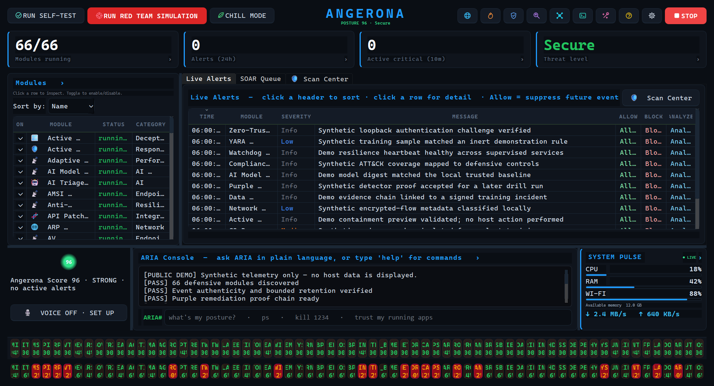
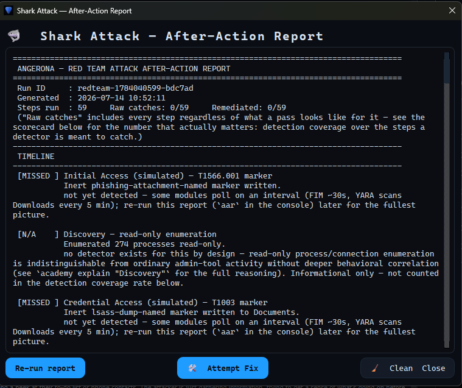
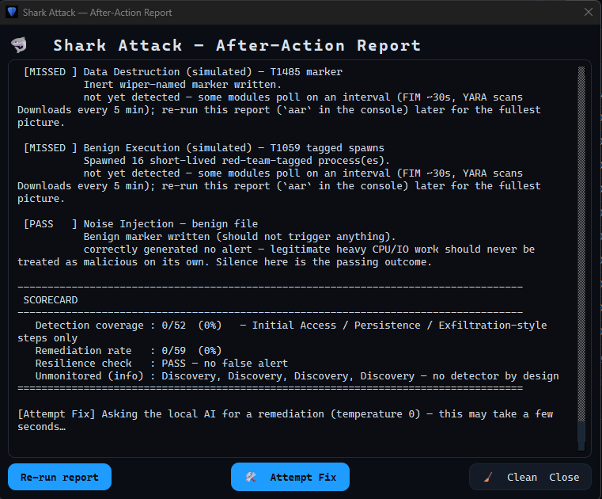
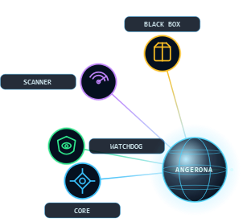

# 🛡️ Angerona — Cyber Security Suite

**Local-first Endpoint Detection and Response (EDR), Network Detection and
Response (NDR), and Security Orchestration, Automation, and Response (SOAR):
full Windows protection plus a source-available macOS Observe preview. Cloud
integrations are optional and off by default. No unsigned kernel driver.**

Key terms used below: Graphical User Interface (GUI), Artificial Intelligence
(AI), Large Language Model (LLM), Security Information and Event Management
(SIEM), Security Orchestration, Automation, and Response (SOAR), Extended
Berkeley Packet Filter (eBPF), Berkeley Packet Filter Compiler Collection (BCC),
Role-Based Access Control (RBAC), Continuous Integration (CI), Software Bill of
Materials (SBOM), Supply-chain Levels for Software Artifacts (SLSA), and
Hash-based Message Authentication Code (HMAC).


A modular, local-first endpoint security suite with a clean native desktop GUI.
The production Windows edition runs elevated in user mode and pulls
kernel-sourced telemetry through supported Application Programming Interfaces
(APIs): Event Tracing for Windows (ETW), Windows Management Instrumentation
(WMI), Antimalware Scan Interface (AMSI), and Windows Filtering Platform
(WFP) — no
custom kernel driver required. The macOS edition is an honest **Observe
preview**: it shares Angerona's core, event model, local AI, and resource
governance while using privacy-minimized process/network snapshots. It does not
claim Endpoint Security or Network Extension enforcement.

| Platform | Current level | Honest capability boundary |
| --- | --- | --- |
| Windows | **Protect** | Full shipped EDR/NDR/SOAR sensor and response path |
| macOS | **Observe preview** | Process-start and established-flow observation; Keychain secrets; no native enforcement yet |
| Linux | **Headless sensor** | Explicit eBPF/BCC sensor path and shared-core services |



*Public demo image: all displayed telemetry, identifiers, timestamps, and counts are synthetic.*
<sub>*Fresh 1920×1040 synthetic public-demo capture. It is generated by `tools/capture_public_dashboard.py` from fixed synthetic events and resource values; no host telemetry, identity, path, PID, or network address is displayed. Current discovery finds 65 modules.*</sub>

> **Privacy & safety first.** Detection and local-AI triage run on your machine
> by default. Cloud escalation, mailbox/Teams integrations, channel push, and
> multi-node forwarding are opt-in and can transmit selected data when enabled.
> Secrets, settings, telemetry, diagnostics, and runtime state are excluded by
> `.gitignore`; review staged files and Git history before publishing a fork.

## ✨ Capabilities

- **Native desktop GUI** (PySide6/Qt) — dashboard, live alerts, module control, settings.
- **Explicit platform capability contracts** — every module reports its supported
  platforms, availability, requirements, and `observe` / `detect` / `protect` /
  `respond` mode. Legacy modules fail closed as Windows-only; an unavailable
  sensor cannot start or inflate the protection score.
- **Platform-neutral sensor events** — Windows, macOS, Linux, and future native
  collectors normalize process, file, network, authentication, and security
  observations into one bounded, versioned schema before EventBus publication.
- **macOS Observe preview** — low-overhead, privacy-minimized process and network
  baselining with command-line collection off by default, macOS Keychain secret
  storage, an authenticated/replay-protected native event boundary, and Xcode
  source scaffolding for a future signed Endpoint Security system extension.
- **Manifest-gated module system** — bundled modules are auto-discovered.
  External `.py` capabilities are disabled by default and require a detached
  Capability Manifest v1 whose source SHA-256, API compatibility, permissions,
  privacy posture, telemetry contract, and resource budget validate before
  Python import. Trusted publishers use Ed25519 signatures; an unsigned
  hash-pinned mode exists only as an explicit development override.
- **Local AI triage** — security events are explained and scored by a local LLM
  (Ollama `llama3`). Live-alert cloud escalation is a separate, default-off
  consent surface and receives only bounded, recursively sanitized evidence.
- **ARIA — conversational security copilot (v1.8.0)** — a talk-to-it HUD with a local-LLM chat (grounded in your runbooks + live posture), spoken threat narration, live read-only email/phishing scanning, on-command indicator research, and adaptive UI performance tuning. Local, gated, defensive-only, and off by default — enable and live-test each piece in **Settings ▸ ARIA**. See "What's new in v1.8.0" below.
- **Core protections, ported from the original Angerona engines:**
  - File Integrity Monitoring (FIM)
  - Process / parent-lineage monitoring
  - Network connection monitoring + packet inspection
  - YARA signature scanning
  - Memory / forensic scanning
  - LSASS credential-dumping detection (Mimikatz/procdump/comsvcs MiniDump)
  - C2 beacon detection (regular-cadence outbound callbacks)
  - Shadow-copy / recovery-tamper guard (ransomware precursor)
  - Removable-media / USB monitor (with autorun.inf flagging)
  - Active deception (canary files & honeytokens)
  - Flight-recorder persistence (tamper-evident SQLite ledger)
- **Red Team Simulation console** — an unannounced, non-destructive adversary simulation with an Intensity slider (Low→Extreme), Campaign (chained kill-chain) mode, a live ATT&CK kill-chain view, an embedded sandbox editor, a History tab of past reports, and plain-English "analogy" coaching (Flight Instructor). Every technique is a benign, reversible marker.
- **Shark Attack drill** — the classic commodity-malware chain (lure → discovery → persistence → exfil markers) with an animated swimming-shark indicator; exercises detect-and-respond end to end.
- **After-Action Report** — every drill produces a report. Simulated gaps use **Apply Fix Candidates** to install exact Purple Guard candidates under authenticated action contracts; application and cleanup are scored separately from verified closure. Only a fresh, technique-bound rerun can close a gap, and expiry or a later miss reopens it. Genuine host weaknesses retain the reviewed **Attempt Fix** workflow. **🧹 Clean & Close** erases drill markers.
- **Resolve Center** — the Threat-level box lists the CRITICAL/HIGH alerts driving it, each with Allow / Block / Analyze / Research / Apply and **Ignore** (acknowledge → excluded from the threat level), so false positives clear back to Secure.
- **Trusted Processes** — Settings includes exact-path trust plus supervised discovery of currently running executables. Path-rich telemetry requires an exact canonical path; basename entries are a pathless-telemetry fallback and cannot suppress memory scanning. Resolve Center's **Allow** action is process-aware.
- **MITRE ATT&CK heatmap (tabbed)** — live heat matrix + a Coverage tab (Detect/Simulate/Remediate map with % and blind spots) + a Top-Techniques tab, richer cell detail, search, and an AI posture summary.
- **Posture Hardening (self-healing)** — records exploited host weaknesses and stages review-gated PowerShell/registry remediations; simulated drill gaps are kept on a separate deterministic resolution path and reopen on a later failed run.
- **Active defense (SOAR)** — under a corroborated attack, Angerona auto-contains the offending process (suspend → kill on repeat) and **isolates its network** with a hidden firewall rule, so it can't reach a C2 even if resumed. A protected-process allowlist and 2-signal corroboration keep Windows itself safe.
- **Incident kill-chain timeline** — related alerts are grouped per process and laid out along the ATT&CK chain (Recon → … → Impact) so you can see how far an attack got, with severity and progress. Double-click a technique for its MITRE page.
- **Consent-gated IR triage bundle** — create a bounded, redacted and
  pseudonymized support archive with a privacy manifest for review before
  sharing. It excludes raw command lines, executable paths, usernames, host
  names, credentials, databases, key files, and arbitrary operator-selected
  files by construction.
- **Scheduled AI security briefing** — a daily plain-English summary (alert volume, top techniques, incidents, containment) via the local model, with a deterministic fallback so a briefing is always produced.
- **Threat Intel — CVE ignore & AI fix advisor** — ignore un-actionable CVEs (too vague / no fix) so they stop inflating the threat level, kept with a revertable per-ID history. The local AI compares each CVE to your system and, where a scriptable fix exists, offers **❗ Apply** (confirm-then-execute, with a one-click **↩ Revert**). A **Mass Flag & Ignore** button clears the no-fix CVEs in one go.
- **Multi-process resilience ecosystem** — core, Watchdog, sensor scanner and Black Box run as separate programs that keep each other alive (auto-restart, no duplicate instances), so one crashing can't take the others down.
- **Watchdog Monitor** — supervises every module and auto-restarts any that crash (throttled), keeping the suite resilient.
- **World View** — a deep-transparency telemetry dashboard: host↔suite resource matrix, a telemetry-blinding detector, and live Ollama diagnostics (VRAM, tokens/sec).
- **Auto-update from GitHub Releases** — one click to pull the latest
  checksummed, provenance-attested build.
- **Elevated user-mode access** — UAC elevation on launch for full-system visibility, without the risk of an unsigned kernel driver.

## 🚀 One-click Windows install from GitHub (recommended)

1. Download `Angerona-<version>-win64.zip` and its adjacent `.sha256` from the
   [Releases](../../releases) page, then verify the SHA-256 and GitHub build
   attestation.
2. Extract the ZIP and double-click **`Install-Angerona-Release.bat`**. It
   verifies the packaged executables again, installs the one-file app and
   exact-hash-gated Black Box under protected `%ProgramFiles%\Angerona`, and
   creates the desktop shortcut.
3. Launch from that shortcut. Mutable data defaults to protected
   `D:\AngeronaData` on a fixed D: volume, with protected
   `%ProgramData%\Angerona` only when D: is unavailable. Legacy per-user C:
   spill is migrated collision-safely on the first storage-hygiene pass.

Python, YARA-X, voice libraries, and the verified offline speech model are
bundled; no terminal commands or dependency downloads are required. Releases
also publish a complete locked dependency set, an SBOM, and build attestations.

The automated release currently provides checksum/provenance verification, not
an Authenticode publisher certificate, so Windows may display **Unknown
Publisher**. Verify the SHA-256 file and GitHub attestation before approving UAC.

## 🧰 Source/developer install

Contributors can clone the repository and double-click `Install-Angerona.bat`.
It accepts only Authenticode-valid official Python/Ollama executables, uses the
locked binary-wheel dependency set, discards a pre-existing virtual environment
unless the checkout was already administrator-protected, and then hardens the
checkout. Source scripts are not signed release installers, so this route is for
reviewed development trees; use the protected release installer for normal use.

Development and security checks use the optional, non-runtime tool set:

```powershell
python -m pip install -e ".[dev]"
python -m pytest -q
```

This includes deterministic offline property fuzzing. It does not add a service,
network listener, telemetry upload, or fuzzing dependency to an ordinary
Angerona installation.

`kill-all-angerona.bat` stops only suite-owned Python entry points and unloads
Angerona's resident llama3 model.

### macOS Observe developer preview

The macOS preview is currently source-only; there is no signed/notarized `.app`
release yet. On a reviewed clone with Python 3.10 or later:

```sh
python3 -m venv venv
./venv/bin/python -m pip install -e '.[macos,voice]'
./venv/bin/python -m angerona
```

This starts only capabilities whose platform contract includes macOS. Secrets
are stored in the current user's Keychain. The Python observer does not install
a daemon, system extension, content filter, authorization event handler, or
network blocker. See [`native/macos/README.md`](native/macos/README.md) for the
Developer ID, entitlement, system-extension, privacy-review, and notarization
gates required before a Protect edition can be distributed.

## 🎯 Use cases — who it's for

- **Home-lab & self-hosted defense** — put enterprise-style **EDR/NDR/SOAR** on a
  personal Windows workstation or home server without per-seat licensing, cloud
  accounts, or an unsigned kernel driver. Detection, response, and AI triage all
  run locally.
- **Privacy-conscious / near-air-gapped setups** — **100% local AI** (Ollama) and
  **zero telemetry egress by default**; every outbound path (cloud escalation,
  channel push, threat-intel pull) is strictly opt-in. Nothing leaves the box
  unless you turn it on.
- **Learning detection engineering & MITRE ATT&CK** — watch **Sigma** rules and
  **YARA** signatures fire in real time, explore the live **ATT&CK coverage
  heatmap** (86 techniques / 14 tactics), and read incident **kill-chain
  timelines** — a hands-on way to learn blue-team fundamentals.
- **Blue-team / SOC practice** — triage live alerts, tune false positives via the
  Resolve Center, run the **local-AI security briefing**, and generate a
  **one-click IR triage bundle** for after-action review.
- **Safe adversary emulation / purple teaming** — fire an unannounced,
  **non-destructive 14-stage ATT&CK kill chain** (benign reversible markers),
  then read the **after-action report** to validate and close detection gaps.
- **Phishing & threat-intel triage** — point ARIA at a mailbox for **local,
  read-only phishing scoring**, and let the **CISA KEV** correlation + AI CVE fix
  advisor tell you which vulnerabilities actually apply to your host.
- **A conversational security copilot** — ask **ARIA** anything in plain English;
  it answers from your own runbooks and your local model, and can open vetted
  indicator lookups (VirusTotal / NVD / CISA KEV / AbuseIPDB / URLhaus) on command.
- **A portfolio / résumé project** — a substantial, self-tested security-engineering
  codebase (Python · Rust · Go) demonstrating detection, response, and secure SDLC.

## Red Team Drill

Angerona can exercise its detection-and-response pipeline with an unannounced,
non-destructive adversary simulation. Every technique uses a benign, reversible
marker—no real exploit, secret, or persistence mechanism is touched.

The drill console lets you configure campaign intensity and watch the live
ATT&CK kill chain while Angerona correlates the benign activity into alerts and
SOAR decisions. Public screenshots intentionally omit local usernames and paths.

| After-Action Report | Scorecard and remediation |
| --- | --- |
|  |  |
| Review each simulated technique, its detection result, and the reason behind the outcome. | Build exact Purple Guard candidates, then run a fresh drill for proof. A later miss remains open or reopens the finding. |

---

## 🏗️ Architecture

See [`docs/architecture.md`](docs/architecture.md). In short: independent
**modules** run on background threads and publish events to a thread-safe
**EventBus**; platform sensors cross a bounded, versioned normalized-event
contract before the bus persists alerts to the **flight-recorder** and feeds the
**GUI**. A **ModuleManager** discovers modules, applies their explicit platform
availability contract, and supervises only supported capabilities; an
**updater** checks GitHub for new releases.

## 🔐 Security model

- The Windows Protect edition runs as Administrator (UAC prompt on launch) for
  full visibility. The macOS Observe preview does not silently elevate itself.
- Telemetry via **ETW, WMI/CIM, AMSI, WFP** — kernel-sourced data through
  Microsoft-supported interfaces. A documented `KernelSensor` seam exists if a
  *signed* driver is ever added; no unsigned driver ships here.
- Secrets use the current-user Windows DPAPI store on Windows and the current
  user's macOS Keychain on macOS. Unsupported platforms fail closed instead of
  writing plaintext. The app never trusts a working-directory `.env`.
- Native macOS frames are size-bounded, schema-validated, HMAC-authenticated,
  freshness-checked, and replay-protected before entering the shared core.
- The macOS native source is observe-only and contains no `AUTH` subscription.
  A future Protect build requires Apple-approved entitlements, a signed host and
  system extension, hardened runtime, privacy review, notarization, and tested
  uninstall/rollback behavior.
- Optional network services fail closed: Teams requires an explicit user
  allowlist, Remote Bridge uses mutual authentication and AES-GCM, and SIEM
  forwarding requires verified TLS unless the operator explicitly enables the
  legacy plaintext compatibility mode.

## 🧩 Writing a module

Create a trusted file in `modules/` that subclasses `BaseModule`, then explicitly
enable external discovery with `ANGERONA_EXTERNAL_MODULES=1`. See
[`docs/writing-modules.md`](docs/writing-modules.md). Minimal example:

```python
from angerona.core.module_base import BaseModule, Severity

SUPPORTED_PLATFORMS = ("windows", "macos", "linux")

class PingModule(BaseModule):
    name = "Heartbeat"
    description = "Emits a heartbeat event every 30s."
    category = "Diagnostics"
    supported_platforms = SUPPORTED_PLATFORMS
    capability_mode = "observe"

    def run(self):
        while not self.stopping:
            self.emit("Heartbeat OK", severity=Severity.INFO)
            self.sleep(30)
```

## 🔁 Reproducible checkout & first GitHub push

The current tree is intended to contain only source — local, build, and runtime state (`venv/`,
`__pycache__/`, `*.db`, `logs/`, `diagnostics/`, `remediations/`, `.env`) is
git-ignored. To publish a clean, reproducible repository:

```bat
powershell -ExecutionPolicy Bypass -File cleanup.ps1   :: purge rebuildable junk
git init
git add .
git commit -m "Angerona v1.0.0"
git branch -M main
git remote add origin https://github.com/<you>/angerona.git
git push -u origin main
```

A reviewed development clone reproduces the app with `Install-Angerona.bat`,
using the locked `constraints-release.txt` set. Add optional credentials through Settings, where
Windows DPAPI binds them to the current user and machine.

> **Public-release blocker:** removing a file from the current checkout does not
> remove it from existing Git commits. Historical commits may still contain old
> screenshots, local identity/path data, or artifacts removed during this privacy
> pass. Before making the repository public, audit and deliberately rewrite or
> replace that history, then rotate any credential that ever appeared in it.

> This repository is **`AngeronaSuite/`** only. The older Rich-terminal prototype
> that lives beside it (`agent.py` / `ui.py` at the parent folder) is a separate,
> superseded project and is **not** part of this repo — keep it out of the commit.

## 🔎 Keywords & GitHub Topics

Angerona is a Windows **EDR / NDR / SOAR** platform for **endpoint detection and response**,
**network detection**, **threat hunting**, and **incident response** — with **MITRE ATT&CK**
mapping, **YARA** scanning, **ETW / AMSI / WFP / Sysmon** telemetry, **ransomware** and
**LSASS credential-dumping** detection, **C2 beacon** detection, and **local-LLM (Ollama)**
alert triage. Built in **Python** with a **PySide6** desktop GUI.

**Copy these into the repo's _About ▸ Topics_ field** (Settings not required — it's the gear next to *About*):

```
edr ndr soar endpoint-security blue-team threat-hunting incident-response
mitre-attack yara etw amsi sysmon ransomware-detection c2-detection
malware-detection windows-security siem ollama local-llm python pyside6 security-tools
```

> Topics are the #1 on-platform discovery lever — a search for `edr` or `mitre-attack` can
> only surface Angerona if these are set. Also fill in the one-line **About** description with
> the tagline at the top of this README.

## 📄 License

MIT — see [LICENSE](LICENSE).

## Development and release history

Release notes are ordered from oldest to newest so the latest additions are always at the bottom.

### 🆕 What's new in v1.3.0

- **Threat Posture score** — a composite 0–100 security indicator under the brand (active threats + module health + KEV exposure + ATT&CK heat); click for a breakdown.
- **Eco Mode on by default** — fast, responsive launch; turning it off wakes heavy scanners **one at a time** (no more startup freeze).
- **Adaptive Resource Governor** — automatically slows heavy, non-security-critical module loops when the machine is under load (and speeds them back up when idle), in both Eco and normal mode. The real-time protection path is never throttled.
- **Black Box recorder (auto-launched)** — a separate, strictly read-only diagnostic process (`blackbox_recorder.py`, or the packaged `AngeronaBlackBox.exe`) that starts with the elevated suite and survives even if the main GUI deadlocks. It reads the protected runtime diagnostics and writes only its own bounded archives under runtime-data. Toggle it in Settings ▸ Performance.
- **Crash resilience** — global crash logging (exceptions, native faults, Qt-fatal, UI stalls), a fully guarded UI refresh so a data flood can't take the window down, and a memory-aware Adaptive Resource Governor that hard-throttles heavy modules before the machine thrashes.
- **Mobile Response Bridge (Signal, opt-in)** — E2EE remote control from your phone via `signal-cli`: `HELP`, `STATUS`, `DIAG`, `ECO ON/OFF`, `LOCKDOWN <PIN>`, and token+PIN-gated `KILL`/`SUSPEND`/`ROLLBACK`/`MUTE`. DPAPI-wrapped PIN, single-use expiring tokens, spoof logging. Configure in Settings ▸ Mobile Integration.
- **Linux eBPF sensor node (opt-in)** — a headless-Linux `BaseModule` using BCC to hook `execve`/`tcp_sendmsg` in-kernel and forward events to the Windows GUI over the Remote Bridge; degrades gracefully without BCC/root.
- **Confidential Compute (Intel SGX / Gramine)** — optional: run the suite inside an SGX enclave (`angerona.manifest.template`) so the in-memory flight cache and IPC key are hardware-protected; `core/sgx_guard.py` detects the enclave and encrypts the MEMC cache.
- **Live-Fire Sandbox & Editor** — isolate all sensors and view/edit/hot-reload any module's `.py` behind an AST syntax gate, with revert + history.
- **Online AI consult (Claude-first)** — Threat-Intel "Consult AI" / CVE "AI Proposed Solution" build a full fix/patch you can save; alert "Research" with a follow-up chat. Falls back through OpenAI/OpenRouter/Gemini/local Ollama.
- **Alert actions everywhere** — Allow/Block/Analyze/Research on alert detail windows and module alert feeds.
- **Awareness panels** — clickable status chips → full module window; a per-module resource-intensity row; **Top Talkers** outbound-network view; CRITICAL tray notifications; module sort by On/Off, Status, Category.
- **New console commands** — `intel`, `consult`, `resources`.
- **Deception hygiene** — honeytokens/canaries are hidden (`HIDDEN|SYSTEM`); the red-team drill auto-cleans all markers so it never litters your machine.
- **UX fixes** — reliable panel-resize dragging; Settings-button errors now surface instead of failing silently.

### 🆕 What's new in v1.7.x

**Detection & response**

- **Four v1.7.0 detection modules** — LSASS credential-dumping (T1003.001), C2 beaconing (T1071/T1571), shadow-copy/recovery tampering (T1490, a ransomware precursor), and removable-media/USB (T1091/T1200) brought the suite to 60 modules; v1.7.5 ELAT brought that release to **61 modules** (v1.9.3 discovers 63).
- **Active-defense network isolation** — when SOAR contains a corroborated threat it also blocks that process's outbound traffic with a hidden firewall rule, turning a "suspend" into real containment (protected-process allowlist + 2-signal corroboration still enforced).
- **Incident kill-chain timeline** — per-process ATT&CK-ordered incident view (🎯 Forensics), with severity, progress, and MITRE links; exportable to JSON.
- **One-click IR triage bundle** — 🎯 Forensics ▸ collect a timestamped forensic ZIP (processes, connections, users, events, incidents).
- **Scheduled AI security briefing (BRIEF)** — daily local-AI briefing with a deterministic fallback, written to `shared_logs/daily_briefing.*`.

**Triage & alerts**

- **Resolve Center** — the dashboard Threat-level box opens a Resolve Center listing the CRITICAL/HIGH alerts driving the level, each with **Detail** (Allow / Block / Analyze / Research / Apply) and **Ignore**. Ignoring acknowledges the alert (and identical repeats) and **excludes it from the threat level**, so you can clear false positives and get back to **Secure** — every ignore is revertable.
- **Threat Intel — CVE ignore / revert + local-AI fix advisor** — ignore un-actionable CVEs (kept with per-ID history) so they stop inflating the threat level; the local model compares each CVE to your system and, where a scriptable fix exists, offers confirm-then-execute **Apply** with an auto-captured **Revert**, plus **Mass Flag & Ignore** for the no-fix ones.

**MITRE ATT&CK heatmap (tabbed)**

- **Live Heat** matrix, plus a **Coverage** tab (honest Detect / Simulate / Remediate map with an overall coverage % and blind spots flagged, cross-checked against the real vetted-action allow-list) and a **Top Techniques** tab (hottest techniques ranked; double-click → MITRE page).
- **Richer cell detail** (MITRE link + which modules cover the technique), a technique **search** box, an **Active-only** toggle, and an **Explain posture** button (plain-English summary via local AI, heuristic fallback).

**Red Team Simulation overhaul**

- **New console** — an **Intensity** slider (Low→Extreme, one knob scaling phases/jitter/noise/threat/process bursts), **Campaign** mode (techniques chained in kill-chain order), a **live ATT&CK kill-chain** strip, a marker-location picker, an embedded **sandbox editor** for the engine, and a **History** tab of past After-Action Reports with timestamps.
- **14 chained techniques** (added Initial Access, Privilege Escalation, C2 Beacon, Data Destruction). Analogy coaching (Flight Instructor) and post-run auto-remediation are **on by default**; the legacy Live Offense Monitor no longer pops up (the console shows events).
- **Working settle-window remediation** — the selected marker folder is registered with live File Integrity Monitoring, spawned PIDs are retained for telemetry correlation, and SOAR remains armed through the 45-second detector settle window instead of being disabled before delayed detections arrive.
- **After-Action Report ▸ 🧹 Clean & Close** — erases every benign drill marker / persistence-marker file as the report closes, so a drill never leaves artifacts behind.

**Security hardening (from a whole-project self-assessment)**

- AI self-compilation is **off by default** behind a static denylist gate; the loopback MCP server dropped wildcard CORS and enforces a Host check + optional bearer token; the CVE fix advisor refuses destructive PowerShell; forensics no longer shells out. (See `analysis/Angerona_Security_Assessment_*.docx`.)

### 🆕 What's new in v1.7.5

- **Evidence Lattice Fusion (ELAT)** — a bounded, local, response-free module that promotes MEDIUM evidence only after three modules across two sensor domains corroborate the same structured PID, path/hash, or IP within 90 seconds. Angerona now auto-discovers **61 modules**.
- **Telemetry Expectation Contracts (TECT)** — DRILL now requires an exact trusted ETW/EID 4688 echo before its canary succeeds. Its own announcement can no longer self-acknowledge, and real consecutive misses are preserved for the existing escalation path.
- **Security loop** — 12 new findings were reviewed across three rounds: nine fixed and three deferred. Fixes cover AI-to-PowerShell staging, Authenticode path binding, complete persisted event signatures, bounded concurrent MCP serving, strict generated-containment validation, and compile-before-activate YARA with last-known-good preservation. Deferred work is the Remote Bridge encrypted protocol migration, an Administrator-owned packaged trust root, and privileged ledger-key custody.
- **Measured performance work** — Flight Cache inserts improved 1.57×; redundant static ATT&CK Coverage refresh work fell about 99.9%; recorder preparation saves 13.61 µs/event by reusing the bus HMAC; concurrent shared sensor misses fell from 12 scans to 1, and valid empty snapshots from 8 scans to 1. Long-run GUI work and diagnostic logs are also bounded.
- **Verification** — 177/177 Python files compiled in the final combined Claude/Codex tree, 61 modules discovered with zero errors or duplicate codes, and the full self-check passed 26/26 phases with zero failures.

### 🆕 What's new in v1.7.6 — the "Legendary Upgrades" (next-gen engines)

Seven **additive, read-only, self-tested** engines that turn Angerona's ~61 independent detectors into one correlating, learning, explaining, self-improving system. Each is a `core/` engine + `self_test()` and is **not yet wired into startup** — zero behavior/detection risk until enabled (roadmap foundations, review-gated). Full vision: `analysis/loop/visionary/legendary_upgrades.md`.

- **Angerona Cortex (`core/cortex.py`) ★** — a live entity graph (process/file/user/IP) where every event adds a decay-weighted signal and a per-entity **malice score** rises as *independent weak signals converge on the same entity* — three MEDIUMs from three modules across three tactics on one process fuse into one explainable HIGH. It unifies the ATT&CK tracker, provenance graph, incident timeline, evidence lattice and SOAR into one verdict (self-test: fused entity 65.5 vs a lone HIGH 16.8 — the 1+1=3).
- **One Angerona Score (`core/angerona_score.py`)** — collapses threat level + posture + coverage % + Cortex top-entity into a single 0–100 safety score plus one ranked "do this now" action.
- **Sigma engine (`core/sigma_engine.py`)** — a Sigma-subset matcher so you can import the public community rule library (hundreds of detections, standards-native).
- **OCSF export (`core/ocsf_export.py`)** — maps events to OCSF Detection Findings for real SIEM/XDR interop.
- **D3FEND overlay (`core/d3fend_map.py`)** — the defensive countermeasure for each ATT&CK technique, and whether Angerona implements it.
- **Self-hardening purple-team loop (`core/purple_loop.py`)** — finds detection-coverage gaps and drafts review-gated candidate rules (proposals only; nothing auto-installed).
- **Angerona Copilot (`core/copilot.py`)** — a local, read-only "talk to your EDR" query layer over the Cortex graph and event feed.

### 🆕 What's new in v1.7.8

- **No-overlap scanner wake-up** — turning Eco Mode off now waits for each heavy module to finish one complete baseline/scan cycle before starting the next. ETW, Sysmon, AMSI, Defender telemetry, and the lightweight network decoder remain awake continuously.
- **Alert-storm responsiveness** — Live Alerts no longer creates hundreds of button widgets, and Resolve Center reads only a bounded recent HIGH/CRITICAL window instead of rebuilding from a full day of INFO telemetry.
- **Install-drive runtime storage** — databases, drill/AAR output, scanner reports, settings, allowlists, diagnostics, watchdog state, Black Box data, and temporary work live under `<install-folder>\runtime-data` for source installs. SQLite retention releases unused pages and caps its WAL footprint.
- **Bounded drill/report growth** — benign markers default to `runtime-data\drill-sandbox` (also watched by FIM and YARA); timestamped AAR history keeps at most 40 runs and 30 days. The UI watchdog keeps one bounded 4 MiB archive instead of preserving oversized legacy thread dumps.
- **Clean local-AI stop** — closing/stopping Angerona immediately unloads resident llama3 models; `kill-all-angerona.bat` also handles a wedged Ollama model runner.

The legacy `%LOCALAPPDATA%\Angerona` folder is no longer used for runtime writes.

### 🆕 What's new in v1.8.0 — ARIA (a local, gated "JARVIS")

ARIA is a defensive-only assistant layer for Angerona: a HUD you can talk to, a
brain that answers from your own runbooks, and opt-in connectors — all local,
additive, **off by default**, and each shipped with a `self_test()`. Every action
stays **confirm-then-execute**; nothing touches detection, correlation, or response.

Run every ARIA self-test from the repo root: `python run_aria_selftests.py`
(currently **13/13 PASS** — the modules plus the research→browser bridge and the
email watcher).

**Using it:** ARIA appears as an **ARIA tab** next to Live Alerts (a pulsing orb
tied to your live Angerona Score, a posture sparkline, and a chat box). The chat is
**conversational** — off-runbook questions are answered by your local model
(Ollama) through the guarded client, grounded with your runbook excerpts and live
posture. Configure and **live-test** every feature in **Settings ▸ ARIA** (voice,
email scanning, channel push, research) — each has a one-click test button.

- **ARIA Overdrive** — `core/perf_governor.py`. An adaptive governor for the
  *cosmetic/UI* path (GUI refresh, alert row cap, display batch) that scales to
  live load with hysteresis, and under a threat spike sheds UI work first so
  detection keeps its cycles. Never throttles the security path.
- **ARIA assistant** — `core/assistant.py`. Conversation memory + a READ/WRITE
  tool registry: reads run live, every write is confirm-then-execute with an
  immutable callback/version/argument/preview binding, a five-minute TTL, and a
  collision-safe 128-bit single-use token. Expired previews are pruned. Proactive
  triggers speak, never act. No offensive tools.
- **Runbook RAG** — `core/runbook_rag.py`. Pure-Python BM25 over your markdown
  playbooks; answers cite your own procedures. No model, no network.
- **Posture history** — `core/posture_history.py`. Append-only Angerona-Score
  trend (series/trend/sparkline) for the HUD chart.
- **ARIA routines** — `core/aria_routines.py`. Nightly briefing, weekly red-team
  drill, daily coverage check as pure text composers with suggested crons.
- **ARIA dispatch** — `core/aria_dispatch.py`. Exposes the 6-agent improvement
  loop + subagents as gated WRITE tools on the assistant.
- **ARIA HUD** — `gui/aria_hud.py`. A pulsing orb tied to the live Angerona
  Score (colour + pulse by band), status line, posture sparkline, chat box. Pure
  score→visual core is self-tested; the Qt widget is optional.
- **Conversational assistant** — the HUD chat answers off-runbook questions with
  your **local LLM** (Ollama) through the app's guarded `ollama_client`
  (prompt-injection defense, PII/secret redaction), grounded with runbook excerpts
  and live posture, under a strictly defensive-only system prompt. Runs async so
  the UI never blocks; falls back cleanly when Ollama isn't running.
- **Voice narration (works out of the box on Windows)** — `connectors/voice.py`.
  Spoken threat narration + "hey aria" voice commands, resolving a TTS backend
  automatically: pyttsx3 → **Windows SAPI via System.Speech (zero-install)** →
  win32com. The dashboard's **VOICE & MIC** button opens device, offline-model,
  and privacy settings directly. Opt-in; cloud TTS is explicit.
- **Email scanning (live)** — `connectors/inbox_watcher.py` runs a background,
  **read-only IMAP** poller that scores each message with local phishing
  heuristics (`inbox_triage.py`: SPF/DKIM/DMARC, Reply-To mismatch, lookalike
  domains, exe/macro attachments, lure terms, link masking) and raises phishing +
  CVE-advisory alerts onto the bus. Never marks read / moves / deletes; mailbox
  password is protected in the current-user Windows DPAPI credential store.
- **Other connectors** — `channel_push.py` (Slack/Teams/ntfy/webhook briefings,
  secret-redacted, off by default) and `research.py` + `research_fetchers.py`
  (indicator → vetted, allow-listed lookups). The `research` READ only builds a
  local plan; opening browser sources is a separate confirmed WRITE/egress action
  and defaults off.

#### v1.8.0 three-loop hardening and performance convergence

- **Reliable drills and remediation** — After-Action correlation now requires
  an exact full path or PID plus an opaque drill token, uses bounded step
  windows and single-use evidence, and binds remediation to the triggering
  event. **Stop & Clean** cancels interruptible waits, refuses overlapping
  workers, performs a bounded join, and finishes scoped cleanup.
- **Scoped shutdown** — emergency recovery recognizes only Angerona-owned
  Python entry points, gracefully unloads Angerona llama3 models, and never
  image-kills all Python or Ollama runners.
- **D:-resident, bounded evidence** — runtime data and temporary work remain
  under `<install-folder>\runtime-data` (install on D: to keep all writes on D:). SQLite stays
  hard-bounded and prunes lower-severity rows before HIGH/CRITICAL evidence;
  AAR history, WAL growth, and watchdog logs remain capped.
- **Long-session responsiveness** — unchanged SOAR queue parsing and dashboard
  text/style work are cached; abandoned ARIA action previews are TTL-pruned.
  After a valid 5.4-second production stall showed the GUI waiting behind the
  SQLite writer, dashboard and live-alert refreshes moved to a committed
  revision plus immediate-only reads: a busy refresh keeps the last complete
  view and retries instead of freezing.
- **Response Safety Kernel experiment** — `core/action_policy.py` is a bounded,
  digest-only **shadow evaluator** attached to ARIA WRITE previews. It has no
  authority: confirmation, SOAR, Resolve Center, drills, shutdown, trust, and
  storage never branch on its ALLOW/DENY result.
- **Final three-loop gates** — 205/205 Python files compiled; 62/62 module files
  imported; 61 modules discovered; focused regressions passed 24/24;
  ARIA/research passed 12/12; the full application self-check passed 26/26.
  Raw module diagnostics reported 47 pass and 15 expected stopped/idle/Ollama
  skips, with zero genuine failures.

### What's new (v1.9.1)

- **ARIA lives in the Console.** The assistant is no longer a tab competing with your
  alerts — a compact posture orb sits beside a single prompt bar. Ask in plain
  language ("what's my posture?", "kill 1234", "trust my running apps") and replies
  **stream in live**, while Live Alerts and the SOAR queue stay visible beside it.
- **One-click capabilities.** Voice, Teams authentication, YARA-X, and Windows
  sensors are bundled in the recommended release or installed for contributors
  by `Install-Angerona.bat`. For
  supply-chain safety, the elevated running app no longer installs Internet
  packages into itself.
- **Live progress wheels.** Self-Test, Eco-Mode wake-up, and Red-Team drills now show a
  smooth spinning ring with a **red → amber → green percentage** so you can see work
  actively running to completion.
- **Crash & resilience hardening.** Removed an uncatchable `psutil.open_files()` C-level
  access violation (Python 3.14) that could crash-loop the core; the watchdog now
  **auto-recovers from SAFE_MODE after a cooldown** and supports **manual restart**
  (`wd-restart core|scanner|blackbox|watchdog|*`). Quieter alerting: routine web
  browsing and a slow local LLM no longer inflate the threat level.

### What's new (v1.9.2 — self-defense hardening)

- **Local-tamper & privilege hardening.** A fresh weakness hunt closed several
  elevated-privilege gaps: the cross-process restart channel is now HMAC-signed
  (a forged one raises a tamper alert), the Teams bot binds loopback instead of
  every interface, elevated runtime package installation is disabled and the
  installer uses wheels-only + isolated pip, and a startup audit flags a writable state
  directory — the misconfiguration that would let a standard user read `bus.key`
  and forge signed commands against the elevated agent.

### What's new (v1.9.3 — proof-driven remediation and release hardening)

- **Red-team fixes must prove themselves.** Remediation installs narrow Purple
  Guard candidates; it cannot mark its own run fixed. A fresh drill must produce
  an exact detector echo before the finding closes; correlated SOAR response is
  reported separately rather than being folded into detector coverage.
- **Long-run responsiveness.** Non-blocking dashboard/history reads, bounded
  EventBus queries, subscription deduplication, sequential Eco wake-up, and
  faster process/network collection close the confirmed freeze paths. Measured
  wins include 4.04× faster bounded EventBus reads, 60.97× faster Memory
  Time-Machine connection collection, 4.75× faster posture sparklines, and
  14.92× faster posture trends.
- **Privacy-first conversation.** The dashboard has a direct **VOICE & MIC**
  setup button. The verified offline speech model is installed only by the
  installer or an explicit click. Cloud fallback is default-off and sends a
  bounded redacted question—not live telemetry.
- **Safer exports and integrations.** Incident bundles require affirmative
  consent and are bounded, redacted, pseudonymized, and manifest-audited.
  Remote Bridge uses mutual authentication plus AES-GCM; Teams fails closed
  without an allowlist; SIEM transport defaults to verified TLS.
- **Public release trust chain.** Credentials use current-user DPAPI, YARA runs
  in-process with YARA-X, SIEM defaults to TLS, workflow actions are commit-
  pinned, and releases include checksums, an SBOM, and build attestations.
- **Final verification.** Auto-discovery finds **63 modules**. The repository
  suite passes **54 tests with 1 platform skip**, the full headless harness
  passes **26/26**, and the ARIA checks pass **13/13**.

### What's new (v1.9.4 — Cycle 4 security, proof, and responsiveness)

- **Enterprise trust foundation.** External modules now fail closed before
  import unless a detached Capability Manifest v1 binds the exact source,
  compatibility, permissions, privacy/egress declaration, telemetry contract,
  performance budget, and a trusted Ed25519 publisher. Settings includes a live,
  evidence-based **Enterprise** page that reports proven controls and keeps
  enrollment, RBAC, central policy, and fleet-scale storage visible as honest
  gaps.
- **Causal incident reasoning.** A bounded read-side graph separates unrelated
  simultaneous processes, accounts for PID reuse, connects process/file/network
  evidence, labels temporal ordering separately from stronger causal evidence,
  and links response and proof nodes with an explicit basis and confidence.
- **Proof-carrying remediation.** Every remediation-log entry receives a
  privacy-minimized, HMAC-authenticated receipt chained to its predecessor.
  The chain binds the action-record digest and refuses to certify an `applied`
  outcome without a passed postcondition. Verified fixes publish a receipt
  reference that can appear in the causal graph.
- **Enterprise read APIs.** The local MCP surface now exposes bounded
  `get_enterprise_readiness` and `get_causal_incident_graph` tools. Its existing
  alerts, module-health, and incident tools now use Angerona's canonical event
  and incident fields.
- **Drill remediation now fails closed.** Signed AAR enforcement is on by
  default. Unsigned, tampered, or unverifiable reports cannot teach Posture
  Hardening or use the manual resolution path. A candidate still requires an
  exact detector echo from a distinct later run, and a future miss reopens it.
- **Remediation scores reflect real outcomes.** Failed Active Response attempts
  do not count as remediation. Temporary automated response during a drill is
  limited to recognized drill artifacts and tagged drill processes inside the
  selected sandbox; the normal automatic-response floor remains CRITICAL.
- **Cloud alert analysis has separate consent.** Analyze stays local by default.
  Its optional cloud second stage has a dedicated default-off setting and
  receives only a recursively redacted, depth/node/container/size-bounded alert
  summary. The general ARIA cloud setting cannot silently authorize live-alert
  evidence.
- **Long-session UI freezes are reduced.** Top Talkers moves Windows connection,
  process, interface, and PTR collection off the Qt thread with one in-flight
  worker, and Upgrade Console model discovery/checks are asynchronous. ARP
  Watchdog prevents overlapping Scapy generations. SPEC, AI recovery, and IPC
  helpers are generation-owned so a restarted module cannot inherit duplicate
  workers. Hidden Black Box charts skip repaint work, immediate-only database
  reads preserve the last complete view, and Live Alerts keeps the operator's
  viewport.
- **Watchdog recovery is operator-controllable.** The Watchdog window includes
  **Restart Angerona Core**. Restart requests are authenticated and
  target-specific; the watchdog clears SAFE_MODE, proves the adopted Core's
  executable/command identity, stops it, and launches a clean replacement. It
  refuses to spawn a duplicate if safe termination cannot be established.
- **Measured hot-path improvements.** Bounded deques made saturated ATT&CK and
  compliance retention 14.17× and 3.90× faster; unchanged HEAL directory polls
  improved 816×; status reporting performs about 19% less work. Network,
  forensics, and HEAL long-session/PID state is now pruned and bounded.
- **Runtime and public-release hygiene.** Launcher diagnostics now live under
  `<install-folder>\runtime-data\diagnostics`, alongside the other bounded
  D-drive state. Future repository commits use a GitHub noreply identity. The
  existing Git history and unsigned-publisher boundary still require deliberate
  owner action before publication; see [Privacy](PRIVACY.md) and
  [Security](SECURITY.md).
- **Verification.** Auto-discovery remains **63 modules**. The repository suite
  passes **133 tests with 1 platform skip**, the headless harness passes
  **26/26**, ARIA passes **13/13**, and the focused Cycle 4 gate passes
  **49/49**. A synthetic 100,000-event causal-graph run averaged **29.58 μs per
  input event**, retained its configured **1,000-event** window, respected the
  **2,500-node** cap, and added about **3.81 MiB** RSS.

### Current development — Cycle 5 interactive dashboard and hardening

- **Every dashboard surface now drills down.** Modules Running, Alerts, Critical,
  Threat Level, Modules, Live Alerts, SOAR Queue, ARIA, Console, System Pulse,
  both module-status rows, and per-module resource chips open a live detail view.
  The same accent-line reveal now grows into the real destination window, whose
  bounded scanning header and live metrics continue the motion rather than
  switching to an unrelated dialog. The existing reduced-motion controls remain
  a hard override; Self-Test and Eco remain immediate actions without animation.
- **No new telemetry pressure.** Expanded views reuse bounded data already held
  by the dashboard. System Pulse retains only 90 samples, console text is capped,
  resource activity is capped, and each detail timer stops with its window.
- **Extension and evidence hardening.** External modules are imported from the
  exact bytes that passed manifest verification, remediation receipts now verify
  their underlying signed/hash-chained records, causal-graph receipt references
  are explicitly marked unverified until checked, incident exports redact IPv6,
  UNC paths, URLs and hostnames, and malformed security booleans fail closed.
- **Long-session performance pass.** Provenance graphs, mobile digests, connection
  snapshots, MCP shutdown queues and flight-cache commits are bounded or batched.
  Ledger and attack-feed reads avoid repeated full-history work.
- **Capability Drift Auditor.** A new read-only enterprise auditor compares
  extension source behavior with declared permissions and manifest identity
  without importing or executing the inspected extension.
- **Responsive Red Team console.** The simulation window is fully resizable,
  opens within the usable desktop area, scrolls its configuration on smaller
  displays, wraps the live kill-chain into two rows, and keeps Launch/Stop in a
  sticky footer that remains reachable at the 700×520 minimum size.
- **Enterprise drill evidence.** Shark and Red Team requests now pass a bounded,
  fail-closed safety preflight before any worker or marker starts. Completed and
  cancelled runs produce versioned, HMAC-attested, SHA-256-chained ground truth
  with run/step identities, ATT&CK IDs, privacy-minimized artifact receipts, and
  atomic writes. AAR and Evolution rule synthesis reject altered, unsigned, or
  over-budget drill history.
- **Holographic minimized token.** Minimizing an Angerona window now collapses
  its outline into a vertical line and then a dot inside a lightweight spinning
  holographic globe. Click the globe to extend live radial controls for Core,
  Watchdog, Scanner, and Black Box; double-click it to restore the most recent
  window. Restoration plays the transition in reverse. The orb is draggable,
  remembers its screen position, stays inside multi-monitor work areas, and
  becomes static when reduced-motion is active. It paints at 20 FPS only while
  visible and performs no telemetry collection.

  
- **Crash-isolated packet inspection.** The optional Packet Sniffer runs
  Scapy/Npcap decoding in a bounded subprocess. A native driver or decoder fault
  degrades and restarts only that worker, while Core, the globe, and the
  watchdog remain online. Detection events retain endpoints and credential type
  but never the captured secret value.
- **Watchdog anti-flapping.** Dead heartbeat PIDs are detected immediately,
  while a still-live Core receives a 12-second scheduling grace window for
  heavy boot-time sensor work. A healthy but briefly GIL-delayed Core is no
  longer misclassified as suspended or launched twice.
- **Verification.** The integrated repository suite passes **185 tests with
  1 platform skip**; the headless dashboard/module harness passes **26/26**;
  ARIA passes **13/13**; the compile gate scans **223 files with 0 failures**;
  module discovery finds **63 modules**.

### Current development — macOS Observe architecture foundation

- **One core, explicit sensor editions.** Angerona now has a canonical
  Windows/macOS/Linux platform vocabulary. Modules declare both supported
  platforms and their honest `observe`, `detect`, `protect`, or `respond` mode.
  Non-Windows discovery AST-checks that declaration before importing a module;
  undeclared legacy modules fail closed as Windows-only.
- **No phantom protection.** Unsupported capabilities remain unavailable, never
  start, and cannot be counted as enabled protection. The inventory reports the
  target platform, requirements, supported platforms, mode, and availability
  reason for each capability.
- **Shared event model.** Platform collectors normalize observations into a
  bounded, versioned process/file/network/authentication/system/security event
  schema before entering Angerona's authenticated EventBus.
- **macOS Observe preview.** The first sensor baselines processes and established
  network flows, then emits only new observations on a conservative cadence.
  Command lines and usernames are excluded by default. The module clearly
  reports observe-only/degraded coverage until native telemetry is installed.
- **Native-extension seam.** Frames from a future native host must pass exact
  schema, size, HMAC, freshness, nonce-replay, and macOS-source checks.
  [`native/macos`](native/macos) contains source scaffolding for a signed host,
  `SMAppService` lifecycle, FSEvents file observation, system-extension
  activation, and a NOTIFY-only Endpoint Security client. It deliberately
  contains no authorization/blocking subscription.
- **Native secret custody.** Windows credentials remain current-user DPAPI
  protected; macOS credentials use the current user's Keychain through
  Security.framework without placing secret values in command arguments or
  temporary plaintext files.
- **Honest release status.** Windows remains the packaged one-click Protect
  edition. macOS is source-only until Apple entitlement approval, native Xcode
  integration, Developer ID signing, hardened runtime, notarization, tested
  upgrades/uninstall, and physical Apple Silicon validation are complete.
- **Verification.** The repository suite passes **193 tests with 1 platform
  skip**. The focused platform contract passes **8/8**, and the compile gate
  scans **230 Python files with 0 failures**. Windows discovery reports **64
  declared modules, 62 available, and 0 discovery errors**; a simulated macOS
  target imports only its **4 explicitly compatible capabilities** with 0
  discovery errors.

### Current development — Cycle 6 enterprise trust and telemetry integrity

- **Forwarded Teams requests cannot use development authentication.** The
  development bypass is process-local, direct-loopback-only, and unavailable
  when forwarding headers, a tunnel, a non-local peer, or persisted settings
  are involved. Other requests require a valid JWT.
- **Runtime authorities have separate protected custody.** EventBus and shutdown
  commands no longer share a key. Elevated startup protects the runtime parent
  before key access and quarantines unsafe pre-existing authorities. These
  user-mode ACLs do not protect against an already-compromised
  Administrator/SYSTEM principal.
- **The fast telemetry path verifies evidence.** The indexed SQLite cursor
  validates each Event HMAC before display. Invalid rows cannot become trusted
  alert content; the UI substitutes a canonical Critical integrity event.
- **Kernel-boundary posture is observable without a production driver.** A new
  bounded, authenticated, read-only ledger records Code Integrity, HVCI/VBS,
  vulnerable-driver controls, driver-service state, and evidence-source health.
  It does not claim kernel enforcement. The custom driver remains lab-only
  pending separate review, signing, compatibility, fuzzing, and recovery gates.
- **Network containment is typed and transactional.** WFP plans are
  deterministic, expiry-bound, narrowly scoped, preserve loopback/DNS/DHCP
  recovery, bind approval to the exact plan, require rollback evidence, and are
  reconstructed before apply. Preview is the default. Angerona does not
  silently install firewall filters; enforcement still requires a separate
  privileged, auditable broker.
- **Coverage and high-volume views are bounded.** Per-sensor accounting reports
  gaps, duplicates, regressions, missing sequence metadata, staleness, and
  eviction. Resolve Center renders 25 rows per page and skips unchanged
  rebuilds. The telemetry cursor retains its measured **14.9x / 93.3%**
  idle-poll improvement.
- **Deployment claims remain narrow.** Source launch adds fail-closed trust-root
  preflights, but an editable user-owned checkout remains weaker than the
  signed, Administrator-owned packaged install. Angerona is user-mode, is not
  tamper-proof or enterprise-certified, and ships no production kernel driver.
- **Recorded Cycle 6 verification.** Repository pytest **223 passed / 2
  intentional platform skips / 0 failed**; compile **233/233**; discovery **65
  modules / 0 errors**; headless self-check **26/26**.

### Current development — all-in-one local security platform foundations

- **Normalized local evidence.** `EvidenceStore` provides a versioned,
  size-bounded SQLite evidence model and deterministic Event normalization.
  Typed hunt predicates replace arbitrary SQL, preserving an offline-first,
  least-privilege boundary.
- **Detection-as-code packages.** Detection content is represented as bounded
  JSON packages with metadata, telemetry requirements, ATT&CK mappings,
  severity/confidence, fixtures, performance budgets, expiry, rollback, and
  digest verification. Packages cannot execute Python or shell code.
- **Explainable exposure and recovery planning.** Deterministic exposure
  scoring produces auditable factors instead of opaque risk numbers. Recovery
  plans require prerequisites, verification, rollback, and an explicit human
  approval boundary; the planning layer rejects execution authorization.
- **Responsiveness remains a gate.** Evidence persistence is intentionally not
  attached synchronously to EventBus producer threads. Live integration
  requires a bounded asynchronous ingest worker with backpressure and shutdown
  draining before it can be enabled safely.
- **Recorded foundation verification.** Repository pytest **237 passed / 2
  intentional platform skips / 0 failed**; focused enterprise-foundation tests
  **14/14**; compile **236/236**; discovery **65 modules / 0 errors**; headless
  self-check **26/26**.
- **Honest scope.** These are load-bearing foundations, not a completed
  enterprise product. At this historical checkpoint, fleet identity/RBAC,
  signed content distribution, privileged containment brokering, inventory
  collectors, async live evidence ingestion, recovery execution, and signed
  installer/update provenance remained separately gated work; the newer
  checkpoint below records which local foundations were subsequently closed.

### Current development — enterprise control-plane and assurance foundations

- **Loss-aware evidence pipeline.** The authoritative flight recorder and
  normalized evidence read model now use bounded asynchronous workers, batched
  transactions, explicit overflow/dead-letter metrics, and shutdown draining.
  A 10,000-event recorder benchmark sustained about 19,600 publishes per second
  and drained without authoritative loss.
- **Signed detection and policy lifecycles.** Detection packages fail closed to
  signed-only activation, revalidate their current trust key and content on
  every active read, and quarantine tampered or revoked packages. Signed policy
  bundles support deterministic resolution, preview, staged rollout, expiry,
  rollback, and authenticated approval receipts.
- **Fleet-ready local contracts.** Endpoint identity, one-time enrollment,
  revocation, replay ledgers, persisted connection sequencing, targeted jobs,
  typed results, asset inventory, and scoped Role-Based Access Control (RBAC)
  now have bounded local implementations and tests. These are foundations for a
  future control plane; Angerona does not claim a deployed central fleet service.
- **Incident and evidence governance.** Cases provide optimistic concurrency,
  bounded timelines, evidence references, privacy-minimized exports, legal
  holds, authenticated custody heads, and signed retention receipts. Restricted
  references and comment bodies are excluded from sanitized exports by default.
- **Artificial Intelligence (AI) safety boundary.** Model input and output are
  treated as untrusted. The broker separates explanation, recommendation,
  planning, and execution; generated PowerShell and Python are staged for
  review and are never hot-loaded or executed as model authority.
- **Release and repository assurance.** GitHub Actions use immutable commit
  pins and least-privilege permissions. Continuous Integration (CI) covers
  Python 3.10–3.13, dependency audit, CodeQL, secret scanning, Open Source
  Security Foundation (OpenSSF) Scorecard, CycloneDX Software Bill of Materials
  (SBOM), signed offline-bundle verification, rollback preflight, and
  Supply-chain Levels for Software Artifacts (SLSA)-compatible provenance
  skeletons.
- **Final Cycle 7 verification.** The repository suite passes **334 tests with
  2 intentional platform skips**; compilation, workflow policy, and dependency
  integrity checks pass; the headless integration harness passes **26/26**.
  Independent adversarial rechecks closed detection trust, replay, workflow,
  case privacy/custody, authorization binding, and scope-canonicalization
  findings.
- **Remaining enterprise gates.** Production mutual Transport Layer Security
  (mTLS), tenant-isolated central services, a separately privileged containment
  broker, Authenticode certificate custody, branch rulesets, long-duration soak
  tests, compatibility labs, external penetration testing, production driver
  qualification, and Apple entitlement/notarization remain external or
  release-level work. They are not presented as shipped capabilities.

### Current development — local fleet preview, response safety, and faster quality gates

- **Canonical Settings and Information.** Settings now owns each configurable
  capability exactly once. A searchable Information tab explains purpose,
  step-by-step use, verification, privacy boundaries, and provides **Take me
  there** navigation. Mobile configuration moved out of the diagnostics console
  and into its single Settings owner.
- **Consistent motion and accessibility.** Explicit Close, Cancel, and window
  **X** actions now use the same reduced-motion-aware reverse reveal as the
  opening transition. No second window is spawned for the animation.
- **Authenticated local fleet preview.** An opt-in service binds only to
  `127.0.0.1`, uses a protected per-install secret, HMAC-authenticated requests,
  freshness checks, durable nonce replay rejection, bounded payloads,
  tenant-scoped SQLite queries, event deduplication, quarantine/revocation
  enforcement, and authenticated ingestion receipts. It is disabled by default
  and is not presented as an internet-facing or mutual Transport Layer Security
  (mTLS) enterprise server.
- **Typed enterprise response boundary.** Registered response operations have
  explicit validators, targets, risk, expiry, rollback, idempotency, and signed
  receipts. There is no generic shell. Preview never executes; live medium/low
  risk needs an independent approval and high/critical response needs two
  distinct non-requester approvals.
- **Privacy-minimized identity defense.** A bounded local analytics layer detects
  password spray, distributed account targeting, repeated authentication
  failures, new privileged sign-in sources, and interactive service-account
  use. Accounts and sources are HMAC-tokenized before retention; credential
  material is never accepted.
- **Privacy-minimized network analytics.** A fixed-memory Network Detection and
  Response (NDR) layer detects low-jitter periodic beaconing, private lateral
  fanout, broad external fanout, and large asymmetric uploads. Process and
  destination identities are HMAC-tokenized before retention; packet payloads
  are not accepted.
- **Durable exposure lifecycle.** Host-applicable vulnerabilities now have a
  local lifecycle for ownership, deadlines, mitigation, bounded risk
  acceptance, expiry, verified closure, optimistic concurrency, and
  authenticated audit receipts.
- **Signed plugin lifecycle.** Reviewed extensions can be staged, revalidated,
  activated for restart, versioned, revoked, and quarantined without executing
  code in the lifecycle manager. Exact signed source and manifest snapshots are
  preserved; trust changes, tampering, and entrypoint collisions fail closed.
- **Offline interoperability gateway.** Privacy-reviewed Open Cybersecurity
  Schema Framework (OCSF), Structured Threat Information Expression (STIX),
  OpenTelemetry Protocol (OTLP), and Angerona envelopes use a signed durable
  queue with idempotency, bounded backoff, and dead-letter handling. External
  egress remains denied by default.
- **Enterprise governance baseline.** Supported-edition claims, semantic and
  protocol compatibility, six architecture decisions, detection-content
  governance, ownership roles, vulnerability response targets, diagnostic
  privacy, and support escalation are now committed repository policy.
- **Safe fleet hunts.** A typed, authenticated hunt lifecycle supports only
  registered evidence artifacts, explicit device/group targets, independent
  approvals, privacy-sensitive two-person approval, host/byte/time budgets,
  durable tamper-evident state, and signed result receipts. Arbitrary paths,
  scripts, commands, and remote shells are forbidden.
- **Non-executable hunt notebooks.** Typed queries, analyst notes, findings,
  decisions, and immutable evidence/result references use optimistic
  concurrency and authenticated atomic persistence. Sanitized export redacts
  identities and local paths, omits device tokens, excludes restricted results,
  and never includes raw artifacts or executable cells.
- **Hunt operations and case promotion.** Per-host progress and coded failures
  persist with authenticated records, non-regressing counters, exact host/byte
  budgets, and bounded latest-state summaries. Verified result references
  promote idempotently into an investigating case with a custody chain.
- **Safe live response.** A target-bound session lasts no more than 30 minutes
  and exposes only registered read-only queries and separately approval-gated
  Response Broker operations. Host-changing sessions need two independent
  approvals, executable fields are forbidden, duplicate requests do not rerun,
  and the privacy-minimized transcript is hash-chained and authenticated.
  Slow read handlers run outside the session lock, so session close and expiry
  remain responsive; a result arriving after closure is recorded then discarded.
- **Bounded recovery evidence.** Registered local reliability drills exercise
  transient locks, unavailable collectors, supervised service restart, and
  dead-letter exhaustion with explicit retry classes, attempt/time limits, and
  content-addressed results. A short atomic-replace retry also tolerates
  temporary antivirus sharing locks without concealing persistent failures.
- **Fixed local release gate.** A no-shell runner records serial tests, bytecode
  compilation, Ruff, dependency audit, and documentation drift against the full
  source commit. Its bounded evidence pack stores redacted summaries plus
  command/output/manifest digests and known limitations. Publisher signing and
  long physical-host soak evidence remain separate release gates.
- **Encrypted backup and offline restore.** Selected data-root files and
  consistent SQLite snapshots stream into an authenticated encrypted archive;
  filenames and payloads are not exposed. Restore verifies every digest, stages
  all content, requires the suite offline plus two independent approvers, and
  retains the previous files for rollback. Key recovery, scheduling, retention,
  and full disaster recovery remain operational gates.
- **Recovery policy and drill evidence.** Disabled-by-default backup cadence,
  exact selections, destination class, verified-copy floor, age/count retention,
  and signed deletion proposals are calculated without scheduling or deleting
  anything. Named scenarios define Recovery Point Objective (RPO) and Recovery
  Time Objective (RTO); drill evidence measures both and requires archive,
  manifest, service-health, and rollback verification.
- **Signed audit export.** Exact tenant, scope, time, and record limits produce a
  privacy-minimized local exchange: restricted fields are removed, sensitive
  values and actors are tokenized, free text is redacted, truncation is explicit,
  records form a custody chain, and the manifest is authenticated.
- **Fewer Defender prompts.** Normal startup no longer rewrites the
  highest-privilege scheduled task. Startup registration changes only when the
  operator explicitly changes that setting.
- **Stateful watchdog recovery.** The Core Manager and peer Watchdog keep
  separate HMAC-authenticated recovery ledgers. Dead and suspended components
  receive a privacy-minimized signed diagnostic snapshot before recovery,
  exponential restart backoff, a durable rolling crash budget, and safe mode
  that survives supervisor restarts. A corrupt or forged recovery ledger pauses
  automatic respawn until an authenticated manual restart resets it; a clean
  stopped heartbeat and signed stand-down remain stopped.
- **Faster engineering loop.** Pinned Ruff, pytest-xdist, and pip-audit tooling
  adds a fast undefined-name gate, optional parallel execution for isolated
  test groups, and dependency vulnerability review. The full suite stays
  serial by default because Windows security/Access Control List (ACL) tests
  intentionally mutate file permissions and are not process-parallel-safe.
  Ruff immediately found and closed a latent ARP Watchdog type-name defect.
- **Verified GitHub developer toolkit.** `tools\bootstrap_github_toolkit.ps1`
  downloads exact Windows releases of
  [uv](https://github.com/astral-sh/uv),
  [py-spy](https://github.com/benfred/py-spy), and
  [hyperfine](https://github.com/sharkdp/hyperfine), plus the official
  [GitHub CLI](https://github.com/cli/cli). It verifies their pinned SHA-256
  digests and keeps them under ignored `.dev-tools`. Bandit, Vulture, and
  pytest-timeout run in a separate audit environment, so these tools never
  become Angerona runtime dependencies. `tools\run_developer_toolkit.ps1`
  produces security/dead-code evidence, repeatable benchmarks, or an
  administrator-authorized live hang profile.
- **Proof-driven drill remediation.** The old AAR closure counter had a field
  that was never populated, structurally pinning simulated finding closure at
  zero. Each unique actionable technique now receives a typed, HMAC-authenticated
  action contract with exact scope, preconditions, safety checks, operator
  authorization, idempotency, expiry, rollback, and standalone signed receipts.
  Installing a Purple Guard candidate and cleaning inert markers produces only
  an **applied** receipt. A later, different run must provide an exact
  technique-bound Purple Guard detector echo before the AAR grants
  **verified closure**; wrong detector/run/technique/contract evidence fails
  closed, repeated occurrences are deduplicated, and expiry or a future miss
  reopens the gap. Detector coverage, same-run SOAR response, action application,
  and verified closure are separate scorecard values.
- **Source-launcher fixed-volume check repaired.** The elevated developer
  launcher previously read `DriveType` from a PowerShell path object where that
  property is blank, causing a valid D: checkout to be refused as redirected or
  non-fixed. It now resolves the volume through the Windows `DriveInfo` API,
  requires a ready fixed drive, and retains the existing reparse-point and
  required-file checks. The independent Python source/interpreter trust
  preflight still runs before `pythonw`.
- **Protected-storage launcher migration repaired.** Windows `icacls` ownership
  and permission changes now run as their required separate command forms; the
  previous combined invocation failed with an invalid `/setowner` parameter and
  stopped startup. Existing runtime trees are closed at the root first, checked
  for reparse points, migrated with fail-closed native ownership and permission
  passes, and marked only after completion so an interrupted migration resumes.
  The launcher displays each one-time phase instead of presenting a blank
  console.
- **Deterministic trust-boundary fuzzing.** A pinned, development-only
  Hypothesis harness now derives 120 offline-replayable examples per property
  for normalized sensor events, authenticated Inter-Process Communication (IPC)
  frames, signed capability manifests, detection packages, fleet request
  authentication, encrypted-backup metadata, portable restore paths, signed
  release envelopes, ZIP member paths/metadata, and Sigma rule documents.
  Parsers must return a fully validated object or their documented fail-closed
  error. The runs found and fixed malformed
  platform/header exception leaks, mixed-type diagnostic failures, silent list
  truncation, non-finite detection values, schema-smuggling fields, and Windows
  alternate-data-stream/device aliases. Imported update, offline voice-model,
  and inert drill-marker ZIPs now pre-validate canonical paths, entry and
  expansion budgets, compression ratios, duplicates/case collisions, encryption,
  special files, and supported compression before reading or writing content.
  Signed update metadata uses an exact schema and strict signature encoding;
  voice downloads cannot redirect away from the approved HTTPS origin. Sigma
  YAML is size/node/depth/document bounded, alias-free, and limited to plain
  finite values. This completes current local user-mode document/archive
  coverage; a future native-driver Input/Output Control (IOCTL) boundary would
  require its own separate fuzz gate.
- **Authenticated scanner-to-core IPC.** Shared-memory ring v2 protects every
  scanner record with a dedicated, access-controlled Hash-based Message
  Authentication Code using Secure Hash Algorithm 256 (HMAC-SHA-256) key. The
  tag binds the schema, sensor, full 64-bit sequence, and payload. Wrong-key,
  modified, replayed, out-of-position, unknown-schema, oversized, and malformed
  records are discarded before EventBus publication. Known process telemetry is
  strict UTF-8 JSON with an exact bounded schema; a valid non-object JSON frame
  can no longer terminate the ring-drain thread. Rejections are counted and
  surfaced with rate-limited alerts instead of retaining raw rejected payloads.
  This detects ring-file corruption and forgery without the protected key; it
  cannot prevent a fully compromised scanner process that can read that key from
  creating authenticated records.
- **Lifecycle and alert-storm backpressure.** Long-running GUI telemetry no
  longer retains every EventBus object identity or an unlimited presentation
  queue. Worker and UI stages each retain at most 2,000 newest events, render no
  more than 250 rows per tick, expose drop counters, and keep a bounded 4,096
  identity window that distinguishes recycled object identifiers by timestamp.
  Stopping the flusher discards late worker results. System Pulse suppresses
  completion after shutdown; voice resolution/listening and the full self-test
  are single-flight; telemetry canary echoes retain the newest 64 without ever
  blocking a publisher. Existing generation tests also prove non-overlapping
  restart, restart cancellation, shutdown drain, sleep/resume, and late-dialog
  result handling. A synthetic 100,000-event burst retained exactly the newest
  2,000 records, accounted for 98,000 drops, and enqueued in 216.46 ms.
- **Security-boundary matrix closed.** Endpoint enrollment binds the stable
  device identity to its Ed25519 public key; persisted identity/access state is
  signed, and key rotation must prove continuity from the already-trusted
  identity and old key. Policy verification rejects changed, expired,
  non-finite, or non-JavaScript Object Notation (JSON) data. Plugin catalogs and
  entrypoints use exact schemas, portable names, confinement and reparse-point
  checks, and activation rebinds the signed capability identity, filename, and
  digest. Protected startup clears the unsigned-extension development override.
  Local Artificial Intelligence (AI) output uses an exact cited-evidence schema;
  typed tool calls carry a short-lived, one-time Hash-based Message
  Authentication Code using Secure Hash Algorithm 256 (HMAC-SHA-256) broker
  authorization, and forged, changed, expired, replayed, cross-broker, unknown,
  or oversized calls/results fail closed. The consolidated boundary selection
  passes 74 tests spanning identity, policy, update, receipt, After-Action Report
  (AAR), tenant, replay, expiry, path, plugin, and prompt/tool abuse cases.
- **Final Cycle 8 verification.** The authoritative serial repository suite
  passes **522 tests with 2 intentional platform skips** and 0 failures.
  Python compilation and
  Ruff pass. pip-audit reports no known vulnerabilities in the installed
  dependencies. The public-repository scan found no committed real credential,
  private key, user-profile path, database, runtime-data, or cache artifact.

## LATEST (2026-07-29 — evidence-rich alerts and universal window motion)

- **Actionable process evidence.** New Telemetry Scanner process-start events
  include the resolved executable location, parent process name and identifier,
  and a bounded command line. Common inline passwords, tokens, API keys,
  authorization values, credentials, and bearer tokens are redacted before the
  authenticated shared-memory frame is written. If Windows denies access or a
  short-lived process exits before enrichment, the record states that limitation
  instead of inventing a location.
- **Readable Alert Detail.** The signed full event record remains the source of
  truth, while an **Observed evidence** panel now surfaces Event, Subject,
  Location, Parent, Command line, and Source fields without requiring the
  operator to interpret raw JSON. Existing legacy records remain readable and
  clearly show unavailable fields.
- **Universal open and close transition.** Newly shown Angerona windows now use
  the same accent-line expansion and reverse collapse even when opened by an
  older or indirect control. Reused hidden dialogs animate again on every show;
  overlapping destinations wait as a masked live line instead of flashing or
  skipping the effect; and close-time confirmation windows can open safely
  during the reverse path. Black Box, Watchdog/Scanner monitors, and standalone
  Sandbox/Upgrade Console processes install the same coordinator and honor the
  saved motion preference. ARIA's **Voice & Mic** button is explicitly routed
  through this transition. Tooltips, pop-up menus, and the holographic token
  keep their purpose-built motion, while reduced-motion controls remain a hard
  override.
- **Performance and lifecycle boundaries.** Only newly observed processes are
  enriched; the recurring process-table diff stays lightweight. The authenticated
  ring uses bounded 2 KiB slots (about 8 MiB total), and strict decoding accepts
  the enriched schema plus normalized legacy frames. Test supervisors use
  isolated D-drive runtime roots and cannot adopt the operator's live Black Box.
- **Verification.** Full serial repository suite: **522 passed, 2 intentional
  platform skips, 0 failed**. Focused universal-window lifecycle gate:
  **16 passed**. The prior 44-test evidence/UI/security gate remains covered by
  the full run. Scanner loop and scanner-to-core lifecycle/respawn self-tests:
  **PASS**. Python compilation, Ruff, and whitespace validation: **PASS**.

## LATEST (2026-08-01 - five-loop security and enterprise evidence pass)

- **Tighter network and parser boundaries.** Product web requests now share a
  central policy for scheme, destination class, credentials, redirects,
  timeouts, and request/response size. Public retrieval rejects private,
  loopback, link-local, and metadata-service destinations. Local service calls
  remain loopback-only. Extensible Markup Language (XML) inputs use hardened
  parsing plus explicit document budgets.
- **Guarded local model transport.** Every Ollama generation path now passes
  through one bounded loopback client. Streaming output is redacted before it
  reaches the interface, errors expose only safe categories, and diagnostics
  retain aggregate timing instead of prompts or responses. World View no longer
  runs a synthetic generation every eight seconds, which removes a recurring
  source of processor load and model wakeups.
- **Bounded long-runtime work.** Posture, voice, legacy sensor, defense, and
  presentation queues retain fixed newest-first windows and never block a
  producer on overflow. Diagnostic text views are capped, hidden Threat Intel
  polling sleeps until shown, and asynchronous dialogs reject late completion
  without deleting a live worker.
- **Observable startup degradation.** Optional-service failures create signed
  Startup Health evidence, and a protection-module loader failure is Critical
  instead of disappearing in a background thread. Diagnostics record impact and
  exception type without copying local paths or secrets.
- **Runtime endpoint identity for Fleet Preview.** Enabling the authenticated
  loopback preview now creates or loads a protected per-endpoint Ed25519
  identity, registers its public identity under the configured tenant, and
  stores the hostname only as a tenant-keyed token. Revoked or quarantined state
  carries into the local fleet record.
- **Evidence-based enterprise status.** Enterprise Readiness version 2 credits
  the tested local identity, Role-Based Access Control (RBAC), signed policy,
  backup/restore, release, audit, privacy, integrity, and bounded-storage
  foundations. Mutual Transport Layer Security (mTLS), Single Sign-On (SSO) /
  OpenID Connect (OIDC), high availability, independent disaster-recovery
  proof, and publisher signing remain visibly separate production gates.
  Settings can copy a deterministic public-safe evidence pack containing no
  hostname, username, path, credential, event payload, or endpoint identifier.
- **Final Cycle 9 verification.** The authoritative serial repository suite
  passes **556 tests with 2 intentional platform skips** and 0 failures. Python
  compilation and Ruff pass. The release gate separately records dependency
  audit, documentation drift, tests, lint, and bytecode evidence. Angerona
  remains a local user-mode security platform, not a claim of enterprise
  certification, kernel tamper-proofing, or a production multi-tenant service.

<!-- ANGERONA_DOC_STATUS tests=556 skips=2 modules=65 -->
