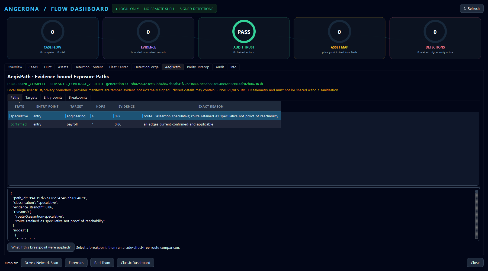
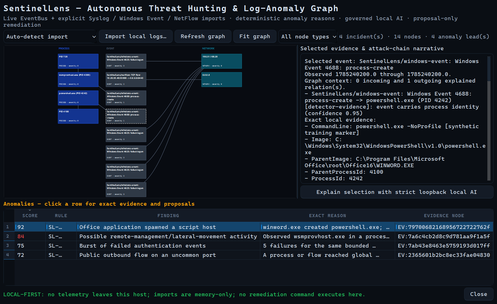
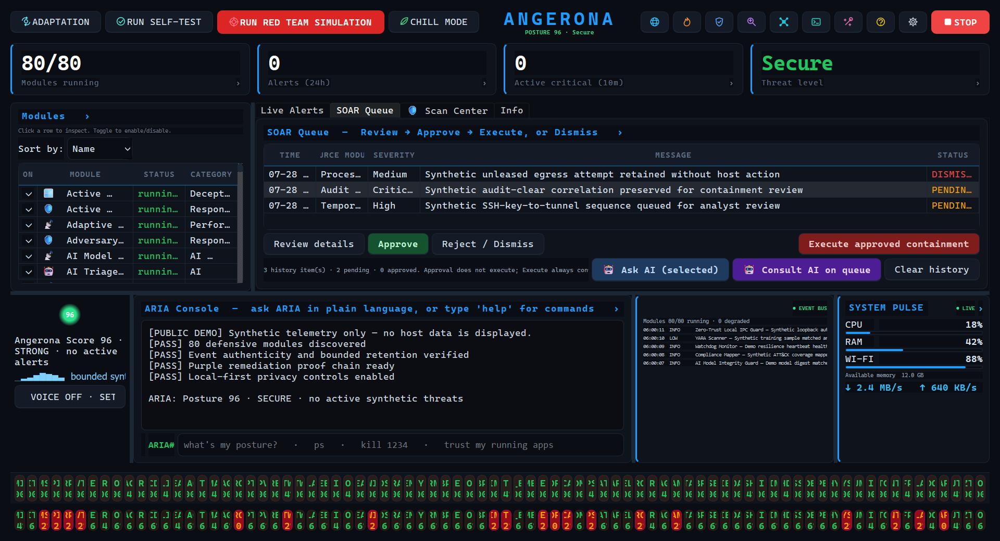
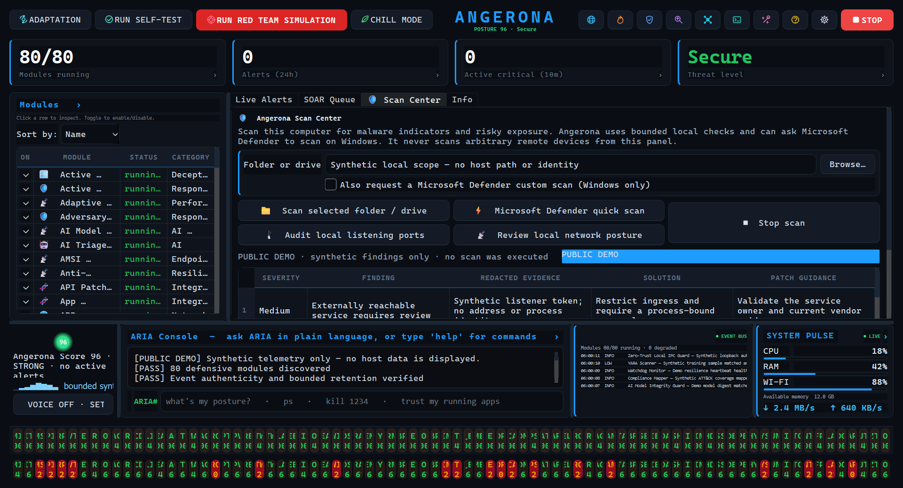

# Angerona Security Suite

Angerona is a local-first defensive security workbench for Endpoint Detection
and Response (EDR), Network Detection and Response (NDR), Security
Orchestration, Automation, and Response (SOAR), digital forensics and incident
response, MITRE ATT&CK validation, and a local Ollama-backed assistant. It is
built for defensive learning, home labs, research, and security-engineering
portfolios—not offensive intrusion or hack-back.

[](https://github.com/Ag3nt47/AngeronaSuite/actions/workflows/ci.yml)
[](https://github.com/Ag3nt47/AngeronaSuite/actions/workflows/security.yml)


Current version: **v1.13.0**

**Windows Safe Startup.** `start-angerona.bat` now opens a separate startup
assistant. Windows bundles include `AngeronaStartup.exe` as their normal launch
entry. Its independent window prepares missing startup folders, verifies storage
and source Python/Qt dependencies, clears inherited launch overrides, and opens
the dashboard in Chill Mode. It closes automatically after that specific
dashboard paints and responds. Failed launches remain visible with repair/log
guidance; a timeout never starts another copy. Settings, evidence and security
journals are preserved. See [startup details](docs/safe-startup.md).

**Responsive self-test results.** Self-test completion now opens a modeless
results window with copy, module-details, retry and Close actions. Manual
failures include next steps; eligible restarts require explicit approval.
Shared deadlines and six active module-test slots prevent timed-out checks
from accumulating on repeated runs. Ordinary event classification also avoids
filesystem path lookups when no registered practice artifact can match.

**Response readiness and responsive USB approval.** Settings → Adversary Combat
now explains whether automatic response is armed, starting, disabled or held for
journal recovery, and shows queue and decision status without reading the journal
on each refresh. Response liveness stays current during idle waits and detector
publishers no longer wait on the action-journal lock. USB PIN/storage checks run
in bounded background workers, with one cancellable prompt at a time. Recovery
and backup-posture alerts no longer masquerade as active intrusions. A narrowly
scoped, explicit startup-checkpoint repair preserves authenticated history.
See [findings, recovery limits and validation](analysis/response-readiness-2026-09-05.md).

[Master Manual](Angerona_Master_Manual.docx) ·
[Current capabilities](ANGERONA_CAPABILITIES.md) ·
[Architecture](docs/architecture.md) ·
[Security](SECURITY.md) ·
[Contributing](CONTRIBUTING.md)

## Dashboard and major features

| v1.13.0 enterprise-pattern Local SOC programs | SentinelLens local-first hunt graph |
| --- | --- |
| [](docs/screenshots/angerona-v1.13-enterprise-programs.png) | [](docs/screenshots/angerona-v1.12-sentinel-lens.png) |
| Main defensive dashboard | Human-reviewed SOAR queue |
| [](docs/screenshots/angerona-v1.11-dashboard.png) | [](docs/screenshots/angerona-v1.11-soar-review.png) |
| Scan Center |  |
| [](docs/screenshots/angerona-v1.11-scan-center.png) |  |

These are reproducible public demonstrations. All displayed telemetry,
identifiers, timestamps, and counts are synthetic.

## What Angerona does

### Detect and correlate

- Windows telemetry from Event Tracing for Windows, Windows Management
  Instrumentation/Common Information Model, Antimalware Scan Interface,
  Windows Filtering Platform (WFP), Defender, Security logs, Code Integrity,
  OpenSSH, and Sysmon.
- Process lineage, persistence, file integrity, memory injection, credential-
  access indicators, ransomware, shadow-copy tamper, beaconing, removable
  media, vulnerable-driver posture, deception, YARA/YARA-X, and network
  behavior detections.
- **SentinelLens** is a local-first threat-hunting and log-anomaly workspace over
  live EventBus evidence and explicit bounded Syslog, Windows Event, NetFlow,
  JSON, JSONL, and array imports. An app-owned background service uses a bounded
  non-blocking queue, continuously maintains deterministic hunt snapshots, and
  exposes queue, parser, and analysis loss without slowing EventBus publishers.
  Its clickable graph links process, network, file, technique, correlation, and
  proof nodes; every anomaly exposes its exact deterministic reason, evidence
  identity, path fields, narrative, and proposal-only remediation. Optional
  narrative assistance is restricted to a strict loopback local-model endpoint
  with no cloud fallback, public/LAN listener, or telemetry export.
- The actor-neutral **SSH Surface / Key / Tunnel Guard** observes bounded
  OpenSSH configuration, public-key fingerprints and custody, services,
  listeners, fixed-provider authentication evidence, and normalized forwarding
  activity. Its live path accepts only broker-authenticated, fixed-schema,
  loss-aware producer evidence. It never retains or publishes full commands or
  raw endpoints, reads private keys, probes a listener, or attempts a login.
- The Windows **Audit Log Integrity Guard** detects explicit clear events,
  logging/audit-policy changes, continuity gaps, record reuse, and authenticated
  cursor damage. Recovery assurance groups separately signed evidence by exact
  revision/archive/manifest cohort. Angerona cannot recreate records that were
  deleted before collection.
- The **Temporal Tradecraft Correlator** and **Identity Session Guard** perform
  bounded, restart-aware correlation over authenticated supplied evidence.
  They do not collect credentials, browser tokens, or cloud sessions.
- The **Driver Provenance**, **Platform Attestation**, and **Peripheral and DMA
  Posture** guards expose signing, catalog, Secure Boot, virtualization-based
  security, Kernel DMA/IOMMU, Thunderbolt, USB4, and removable-media posture.
  Missing evidence stays unknown; local operating-system posture is not
  hardware or firmware proof.

### Treat the network as hostile

- Every physical Wi-Fi and Ethernet path starts untrusted. Privacy-tokenized
  route, gateway, Domain Name System, Dynamic Host Configuration Protocol,
  profile, and interface-generation evidence is compared across restarts.
- The enrolled Personal Sentinel gateway client can attest one exact private
  HTTPS first hop with normal certificate/hostname validation, an additional
  certificate pin, nonce/freshness, policy digest, optional mutual Transport
  Layer Security (mTLS), complete IPv4/IPv6 route evidence, and unchanged
  pre/post route context.
- Introduced in v1.11.0, Angerona supplies a separately operated **Personal Sentinel reference
  authority/server** for mTLS-authenticated Ed25519 receipts, trusted time, and
  monotonic compare-and-swap evidence. It is a reference service operators must
  provision and administer—not a bundled router appliance.
- Neither component discovers or configures routers, stores router credentials,
  changes routes or firewall policy, or proves gateway firmware. A positive
  first-hop label never grants endpoint, identity, application, destination, or
  upstream-router trust.
- The process-egress lease broker and guard bind policy/audit evidence to exact
  process birth, executable, user, destination, path, and budget. Enforcement
  still requires a separately privileged injected adapter; the shipped guard
  does not open, close, redirect, or filter sockets.

### Contain, recover, and investigate

- Exact-target peer blocks, executable isolation, verified process suspension
  or termination, exact-file quarantine, bounded deception, and explicit host
  isolation through signed, typed response contracts.
- Least-privilege checks bind process birth, executable/file identity, peer,
  action type, and escalation scope. Protected/system targets, stale evidence,
  and ambiguous requests fail closed.
- Durable intents, verified postconditions, signed receipts, exact Undo,
  startup recovery, and mutation circuit breakers make response state visible
  and reversible where the operating system permits.
- Live Alerts, Resolve Center, SOAR Queue, Scan Center, Flow Dashboard / Local
  SOC, cases, hunts, evidence custody, ATT&CK views, threat intelligence, and
  forensic exports. Local SOC also hosts Fleet Center, DetectionForge, and
  AegisPath as bounded, clickable enterprise-pattern programs.
- Non-destructive Red Team, Shark Attack, and Adversary Combat validation use
  bounded reversible markers—not exploits, credentials, persistence, outbound
  attack traffic, or remote infrastructure. The default comprehensive Red Team
  plan authenticates 38 mandatory stages and 37 separately scored simulation
  contracts, including 24 fixed inert probes across the major ATT&CK tactic
  families; native analytic catches remain a separate number.

### Adapt safely and inspect details

- **Guided Auto Adapt** offers closed Balanced, Public, and Emergency Lockdown
  choices. It audits, rejects incomplete evidence, builds an immutable plan, and
  simulates without writes before an optional, separately confirmed exact-plan
  apply. Context automation remains proposal-only.
- The explicitly enrolled recovery baseline is authenticated, host-bound, and
  non-replaceable. It restores the complete Windows Firewall policy—the only
  state Host Adaptation mutates—not hardware, services, ports, applications, or
  network devices. Each apply also receives a pre-change snapshot and a
  Hash-based Message Authentication Code (HMAC) transaction journal with
  startup reconciliation and compensation.
- **Run safe automatic checkup** audits once and simulates every registered
  profile without writing.
- All 84 discovered capabilities receive a validated v12 machine-readable
  contract and a common lifecycle/freshness/loss snapshot. The inventory is
  explicit: nine native contracts and 75 compatibility adapters; product and
  module implementation versions are independent.
- Capability Center, Module Inspector, adaptation, alerts, Live Defense,
  Context Info, CVE, and SOAR surfaces provide typed sorting and bounded
  clickable details, including governed paths. Alert analysis is limited to two
  active workers plus six queued exact event identities; SOAR clear is a
  recoverable archive/restore operation.

### Assist locally

- ARIA uses local Ollama for chat, runbook retrieval, defensive briefings, and
  typed tools. Optional cloud paths require separate operator consent.
- **ARIA Defense Memory v1.1.0** contains 18 bounded capability, usage,
  defensive-control, and actor-neutral tradecraft entries. It is strict-schema,
  data-only, and pinned to canonical digest
  `sha256:97a7771a9ce38ac66c6889dc90e0d591b64e07c2f169a0cebd7a57c119d67d57`.
  It cannot define a tool or authorize an action. An already authorized cloud
  fallback can receive at most one highest-ranked canonical, redacted excerpt.
- **Live Defense Activity** displays at most five sanitized public EventBus
  summaries and coarse module health. It is not executing source code, a
  debugger, raw telemetry, hidden model reasoning, or chain-of-thought.

## Best-fit use cases

- Advanced Windows home labs and self-hosted defensive workstations.
- Blue-team, SOC, incident-response, detection-engineering, and ATT&CK learning.
- Safe purple-team validation of detections, response authority, Undo, and
  recovery contracts.
- Defensive monitoring for SSH persistence/tunnels, event-log clearing or
  continuity loss, identity/session anomalies, and suspicious Wi-Fi/Ethernet
  path drift without state or agency attribution.
- Local-AI security research with explicit provenance, data, and action-
  authority boundaries.
- Operator-controlled intermediate gateway/firewall experiments using the
  supplied Personal Sentinel reference contracts and a separately administered
  compatible host.

## Platform support

| Platform | Current contract | Static platform discovery |
| --- | --- | ---: |
| Windows | **Protect:** supported user-mode telemetry and governed response from the signed installed authority. Source checkouts are unelevated Observe/development only. | **84 modules** |
| Linux | **Observe + optional eBPF:** rootless process/flow/posture monitoring; BCC/eBPF is an explicit privileged supplement. | **14 modules** |
| macOS | **Observe preview:** privacy-minimized shared-core process/flow visibility; no Endpoint Security or Network Extension enforcement claim. | **13 modules** |

Static discovery reports **84 modules** on the primary Windows contract. No
unsigned kernel driver is shipped.

## 🚀 One-click Windows install

For a tagged public Windows release, download
`Angerona-<version>-win64.msix` and its adjacent SHA-256 file from
[Releases](../../releases). Windows must trust the exact provisioned package
publisher identity and validate the signed MSIX block map before activation.
No Python or terminal is required.

The repository builds the full-trust x64 MSIX only when the protected package
name, publisher distinguished name, publisher certificate, and signing policy
are provisioned. A clean-VM install/upgrade/uninstall matrix remains a release
acceptance gate; this repository does not claim Microsoft Store deployment.

There is **no public classic Setup first-install path**. The signed Inno wrapper
is restricted to migration of a prior approved installation, performs only
unelevated preflight itself, delegates UAC/mutation to the protected installed
updater, and is not a public release asset. The portable ZIP is also
upgrade-only: its installed native verifier checks exact payload/catalog
evidence, protected threshold roots,
numeric version/sequence floors, and protected path access-control custody
before target mutation. A privileged whole-host snapshot can still roll back a
local floor unless a Trusted Platform Module or independent witness anchors it.

For an unelevated Windows source Observe/development setup:

```powershell
git clone https://github.com/Ag3nt47/AngeronaSuite.git
cd AngeronaSuite
.\Install-Angerona.bat
```

This source path never requests Administrator rights, changes machine scope, or
claims full Protect coverage. It installs only exact/hash-locked dependencies in
the checkout virtual environment and stores source-profile state under the
current user's Local AppData. If launched from an elevated terminal, it refuses
to run. Use the signed MSIX above for the protected installed authority and the
complete Windows Protect path.

For development:

```powershell
python -m pip install -e ".[dev]"
python -m pytest -q
python tools/selfcheck.py
```

Linux and macOS release archives use `Install-Angerona-Release.sh`. Source
installation uses `install-angerona.sh`; Linux also supports a local-user
headless service. Linux kernel telemetry is optional eBPF/BCC—not a universal
shipped CO-RE sensor.

For guarded GitHub synchronization, use `push-to-github.bat` and
`pull-from-github.bat`. Push scans the exact staged patch with a pinned,
SHA-256-verified Gitleaks binary, publishes only explicit non-force refspecs,
requires a safe fast-forward to the public `main`, verifies both remote SHAs,
and downloads every local README image to prove the public bytes match. Pull
scans incoming commits before a fast-forward merge and refuses dirty/divergent
trees, unsafe remotes, submodule recursion, and unreviewed workflow changes.

Unelevated Windows source launches use `%LOCALAPPDATA%\Angerona\SourceData`.
Elevated source launches use the checkout's protected sibling `AngeronaData` directory.
Packaged Windows installs prefer protected `D:\AngeronaData` and use protected
`%ProgramData%\Angerona` only when D: is unavailable. Cloud integrations are optional and off by default.

## Validation status

The September 4 dashboard reliability update moves capability source verification
off the UI thread, preserves unchanged alert rows, bounds Sysmon retained-log
replay, and fixes repeated Defender health-report queue conflicts. Blocked
response prerequisites retain their diagnosis without restarting repeatedly;
the per-user source profile is recognized by Storage Hygiene.
Validation passed 2,891 regression tests with 15 expected skips, plus all 26
headless self-check phases.
See the [runtime reliability record](analysis/dashboard-runtime-reliability-2026-09-04.md)
for validation and remaining host prerequisites.

The Cycle 34 v1.13.0 maintenance five-check release gate passed on exact commit
`7eef1f0a0c400b34f170cbd1463cd3c6a454de3b`. The full serial result is **2882
passed / 15 intentional platform skips / 0 failed in 977.10 seconds**. The
canonical release-evidence manifest SHA-256 is
`8a6b294ea04157f9232fee5567ac2fb8cb45664cb8f3c74b73c08717ba816d8c`;
all five bytecode, dependency-audit, documentation-drift, lint, and unit-test
checks passed.

Cycle 34's completed targeted gate passed **91 tests with two
expected Windows host-capability skips** (symlink creation and POSIX `fork`);
adjacent compatibility/integration
selection passed **128 tests**; package compile passed **368/368**; standalone
self-tests passed **93 with 0 failures**, plus **16 expected platform, disabled,
or optional-prerequisite skips**; and supported selfcheck passed **26/26**. The
validated tree and this terminal completion record use the repository's guarded
canonical GitHub fast-forward publication path.

The earlier v1.13.0 supporting evidence includes repository-wide Ruff,
static discovery of **84** capabilities (**9 native contracts** and **75
compatibility adapters**) without duplicate identity, the **26/26** supported
headless self-check, workflow-policy validation, dependency audit,
documentation-drift validation, and `git diff --check`.

Focused groups overlap and are not a clean-machine deployment, privileged-host,
native Linux/macOS, or independent efficacy proof.

## Honest limits

- Angerona is an advanced home-lab, learning, research, and portfolio suite. It
  is not an independently certified, commercially supported fleet EDR/XDR and
  does not claim complete attack coverage.
- Angerona is user-mode, is not tamper-proof against compromised
  Administrator/SYSTEM or kernel authority, and ships no production kernel driver.
- The repository cannot provision a trusted Windows publisher identity,
  protected GitHub environments, external Ed25519 root custody, enterprise
  package policy, a Trusted Platform Module floor, or a separate backup/witness
  failure domain. Those are deployment responsibilities and release gates.
- Personal Sentinel is a reference authority/server plus an exact enrolled
  first-hop client—not a router, turnkey appliance, routing role, remote command
  channel, firmware attestor, or automatic firewall manager.
- Event-log defenses detect observed clears, gaps, policy/service changes, and
  signed recovery cohorts; they cannot reconstruct events deleted before
  collection or guarantee truth after kernel compromise.
- Identity/session, measured-boot, recovery, process-egress, and RAG provenance
  features remain only as authoritative as their injected producers,
  verifiers, and independently administered evidence.
- Durable SIEM/Remote delivery is at least once and can duplicate after a
  crash. Local row HMACs do not independently witness deletion or rollback of
  the whole SQLite database; transport-key coordination still uses restart
  epochs.
- DetectionForge's local state, checkpoint, governance anchor, and journal do
  not prove rollback of the complete detection root together with its local
  key. That requires an independent service or hardware witness. Ambiguous or
  truncated legacy promotion history fails closed and requires operator
  recovery.
- Fleet Fabric remains local-only and retains at most 5,000 health rows of at
  most 8 KiB each. After a pruned-history restart, admission capacity begins
  conservatively and refills from elapsed trusted time; startup still verifies
  the complete retained set.
- ATT&CK coverage is curated. OCSF 1.8 and Sigma are deliberately constrained
  mappings/evaluation subsets, not complete upstream implementations.
- IPC Guard is an authenticated loopback diagnostic admission preview—not a
  production payload consumer, remote-management channel, or TPM-backed
  transport.
- Research is actor-neutral. A technique pattern does not prove a nation,
  agency, sponsor, or individual.
- No hack-back, remote exploitation, credential theft, arbitrary response
  shell, log deletion/evasion, downloaded executable skill, unverified model,
  or unsigned kernel component is part of the product.

## Cycle 34 maintenance update (release validation complete)

- Replaced the flow canvas's broad repository server with a loopback-only,
  Host-checked exact allowlist. Descriptor/final-path validation, bounded fresh
  metrics, text-only rendering, bounded clients/headers, and an operating-
  system-selected port close the serving and lifecycle gaps.
- Bound DetectionForge to the exact live Detection Runtime and complete active
  set. Promotion now uses atomic recovery, nondecreasing authority time, a
  PID-bound cross-process owner lease tied to the immutable registry, state,
  quality, policy, clock, path, and runtime authority, durable governance
  anchoring, and journaled quarantine convergence. Bounded immutable trust
  snapshots and stable signed-artifact generation proofs close publisher-key
  rotation races.
- Extended Fleet custody to every retained health row. Guarded incremental
  exact-row projections remove the 3N+1 signature/decode path; persistent
  admission state, replay-before-quota handling, and transactional quota
  reservations close restart, replay, and rollback gaps. On the N=250 benchmark
  fixture, the final mutation path fell from about 0.7446 seconds to about
  0.0188 seconds.
- Made Local Operations Center composition nonblocking, cancellable, single-
  flight, and readiness-reserved before dependent modules start. AegisPath
  selection now uses immutable path/node indexes. Detection Runtime benchmark
  decoding fell from 1,920 operations to 30 without changing per-rule budget or
  malformed-input visibility.
- The Windows-target inventory remains **84 capabilities: 9 native contracts
  and 75 compatibility adapters**. No Cycle 34 visionary proposal shipped; all
  eight Round 3 architecture ideas remain backlog.
- Targeted Cycle 34 evidence is **91 passed / 2 expected skips**, adjacent
  **128 passed**, compile **368/368**, standalone self-tests **93 passed / 0
  failed plus 16 expected skips**, and selfcheck **26/26**. The authoritative
  five-check gate passed **2882 / 15 intentional platform skips / 0 failed** on
  exact commit `7eef1f0a0c400b34f170cbd1463cd3c6a454de3b`; guarded canonical publication
  carries the validated tree and terminal record to public `main`.

Detailed evidence is in
[`analysis/loop/cycle34/README.md`](analysis/loop/cycle34/README.md).

## What changed in v1.13.0

- Added three native, embeddable Local SOC programs. **Fleet Center** provides
  sealed enrollment, durable device binding, authenticated health/loss evidence,
  and governed rollout/canary evaluation. **DetectionForge** provides immutable
  replay cohorts, exact active-candidate diffs, an alert-inert shadow lane,
  chained quality receipts, and one-use promotion/rollback receipts.
  **AegisPath** provides evidence-bound exposure graphs, bounded confirmed and
  speculative paths, choke/blast analysis, inert breakpoint counterfactuals,
  and explainable KEV/EPSS/criticality priority.
- Completed three adversarial/visionary cycles. Initial audits recorded 31
  findings (11 High, 18 Medium, 2 Low), all fixed; independent re-attacks then
  found 15 additional bypasses, all fixed. Re-attack evidence remains retained
  rather than being erased by closure.
- Increased the Windows-target inventory to **84 capabilities: 9 native
  contracts and 75 explicit compatibility adapters**. All built-in
  implementation labels are 1.13.0; this is not a claim that adapters are
  native or that tests prove real-world detection efficacy.
- Applied behavior-preserving performance work: Fleet uses one ordered tenant
  custody scan and reuses verified head evidence; AegisPath counts paths in one
  bounded pass, moves initial large analysis off the UI thread, and avoids a
  duplicate Local SOC refresh.
- Historical pre-documentation validation recorded **2788 passed / 13
  intentional platform skips / 1 expected documentation-drift failure**. The
  only failure was the stale README module marker (`81` versus discovery `84`).
  After correction, the authoritative five-check release gate on commit
  `edefd8b07b94da4d682a35ace23057e7b22c3790` passed **2790 tests with 13
  intentional platform skips and 0 failures in 325.19 seconds**. Validation is
  complete for that Cycles 31–33 tree; repository policy requires the guarded
  publisher for release completion.
- Reproduced the hosted Gitleaks 8.30.1 signal locally. Two public inert
  identifiers are suppressed only by exact historical fingerprints; the failed
  push range and the complete 132-commit history both scan with zero findings.
- Boundaries remain explicit: Fleet Fabric implements no remote transport,
  dispatch, HA, distributed quota, or production mTLS service; DetectionForge
  is local governed evaluation; AegisPath provider/absence authority is local
  trust and its simulation proves neither reachability nor remediation.

Detailed evidence is in
[`analysis/loop/cycles31-33-summary.md`](analysis/loop/cycles31-33-summary.md).

## What changed in v1.12.1

- Added SentinelLens: app-owned bounded background standardized-log ingestion,
  explicit queue/parser/analysis loss, deterministic anomaly scoring,
  attack-chain graphing, exact evidence narratives, sortable/clickable findings,
  strict-loopback local AI, and proposal-only remediation.
- Completed five additional adversarial/visionary/upstream-comparison loops over
  every built-in module. The passes targeted exact-object authority, crash
  boundaries, telemetry continuity, rollback, durable delivery, coverage
  honesty, and resource bounds; independent reattacks reopened and drove
  additional fixes instead of being counted as passes.
- Expanded Guided Auto Adapt, an immutable Windows Firewall recovery baseline, safe automatic
  checkups, a default 38-stage/37-contract one-button defensive simulation, and
  item-specific clickable event, stage, assurance, and detail surfaces. Any
  capability below 100% now explains the weakest
  contract dimension and links to governed file, class, field, digest, and a
  red-highlighted verified source line when that location is provable. Missing
  fields use the owning class declaration as an explicit fallback; unavailable
  or untrusted runtime source remains visibly unavailable instead of guessed.
- Retired legacy pathname-, PID-, and display-text-selected mutation routes.
  Response now requires typed exact identities, retained custody, verified
  postconditions, authenticated delivery state, or remains explicitly
  proposal-only.
- Upgraded the suite and built-in module implementation labels to v1.12.1 while
  retaining honest per-capability platform, evidence, and deployment limits.

Detailed Cycle 26–30 evidence, upstream comparisons, hostile reattacks,
remediations, and residual deployment boundaries are under
[`analysis/loop/`](analysis/loop/).

## What changed in v1.12.0

- Added validated v12 capability contracts and operational snapshots to all 80
  discovered capabilities, plus searchable/sortable/clickable Capability Center
  and Module Inspector views. The inventory truthfully records five native
  contracts and 75 compatibility adapters.
- Added Guided Auto Adapt, explicit immutable Windows Firewall recovery-baseline
  enrollment, a no-write all-profile checkup, separate exact-plan confirmation,
  HMAC transaction journaling, startup reconciliation, and circuit breaking.
- Added typed sortable tables and bounded detail/path views across adaptation,
  alerts, Live Defense, Context Info, CVE, and SOAR surfaces; bounded alert
  analysis and made SOAR clearing recoverable.
- Hardened durable SIEM/Remote delivery, EventBus revision cursors, atomic
  settings and Intel Sync publication, proposal-only evolution/mitigation,
  behavioral exact-hash approval, self-integrity, persistence completeness,
  protected-store IPC custody, and typed process/driver/firewall remediation.
- Pinned standards scope to ATT&CK 19.2, Navigator 5.3.2/layer 4.5, constrained
  OCSF 1.8, and a deliberately limited Sigma subset with atomic admission
  receipts.
- Applied measured behavior-preserving performance work: recorder handoff
  improved 28.6%, capability-summary reads 96.5%, and unchanged Module
  Inspector ticks 96.5%. Durable commit batching, immutable compiled Sigma
  plans, and a global CVE detail-worker cap remain proposals.

Detailed three-round evidence, upstream comparisons, fixed lineages, and
residuals are in
[`analysis/loop/cycle25/summary.md`](analysis/loop/cycle25/summary.md).

## What changed in v1.11.0

- Added authenticated sensor-provenance envelopes, ordered temporal tradecraft
  correlation, privacy-tokenized identity/session analytics, process-bound
  egress lease policy/audit, measured-boot appraisal contracts, driver
  provenance, peripheral/DMA posture, immutable recovery assurance, RAG
  provenance, and release-transparency/anti-rollback guards.
- Hardened SSH live evidence with a broker-assigned producer, exact event type,
  fixed provider/channel schema, and explicit sequence-loss accounting before
  trusted source state can advance.
- Added the Personal Sentinel reference authority/server with asymmetric
  response/state signing, mandatory production mTLS, bounded pre-authentication,
  irreversible shutdown, OS singleton custody, and separate trusted-time floor
  namespaces.
- Replaced the candidate-controlled public classic installer story with an
  OS-validated signed full-trust x64 MSIX contract. Kept classic Setup only as a
  prior-install migration wrapper and made portable installation upgrade-only
  with an installed verifier and rollback floor.
- Hardened recovery assessment to require one exact current
  revision/archive/manifest cohort and reject excessive future timestamps,
  mixed/incomplete Linux removable evidence, unbounded evidence enumeration,
  and unstable recovery-file reads.
- Added the sanitized Live Defense Activity card and expanded ARIA Defense
  Memory to 18 pinned entries with a one-excerpt cloud boundary.
- Applied bounded performance/reliability improvements: Personal Sentinel state
  canonicalization was 30.2–39.0% lower CPU in the measured kernel; identity
  replay membership moved from O(n) to O(1); over-budget directory iteration
  avoided full materialization; and public gallery capture became reproducible.

Detailed three-round evidence, fixed findings, deployment residuals, and source
links are in [`analysis/loop/cycle24/summary.md`](analysis/loop/cycle24/summary.md).

## Defensive research sources

Cycle 25 compared Angerona's local contracts with current upstream defensive
projects and standards without claiming parity. Key new primary sources include:

- [Velociraptor client monitoring and offline buffering](https://docs.velociraptor.app/docs/clients/monitoring/)
- [Wazuh stateful/stateless Active Response](https://documentation.wazuh.com/current/user-manual/capabilities/active-response/index.html)
- [Fleet GitOps policy definitions](https://fleetdm.com/docs/configuration/yaml-files)
- [osquery configuration and packs](https://osquery.readthedocs.io/en/5.12.1/deployment/configuration/)
- [Elastic detection-rules validation and testing](https://github.com/elastic/detection-rules)
- [Velociraptor Artifact Exchange warnings](https://docs.velociraptor.app/docs/artifacts/exchange_reference/)
- [MITRE ATT&CK version history](https://attack.mitre.org/resources/versions/)
- [ATT&CK Navigator layer 4.5 format](https://github.com/mitre-attack/attack-navigator/blob/master/layers/spec/v4.5/layerformat.md)
- [OCSF 1.8 observable schema](https://raw.githubusercontent.com/ocsf/ocsf-schema/1.8.0/objects/observable.json)
- [Sigma rule specification](https://sigmahq.io/sigma-specification/specification/sigma-rules-specification.html)

Cycle 24's actor-neutral security research also used:

- [CISA AA25-239A: network-device persistence and off-host logging](https://www.cisa.gov/news-events/cybersecurity-advisories/aa25-239a)
- [CISA AA24-038A: critical-infrastructure tradecraft](https://www.cisa.gov/sites/default/files/2024-03/aa24-038a_csa_prc_state_sponsored_actors_compromise_us_critical_infrastructure_3.pdf)
- [NIST SP 800-207: Zero Trust Architecture](https://csrc.nist.gov/pubs/sp/800/207/final)
- [MITRE ATT&CK T1070.001: Clear Windows Event Logs](https://attack.mitre.org/techniques/T1070/001/)
- [Microsoft: Storm-2372 device-code phishing](https://www.microsoft.com/en-us/security/blog/2025/02/13/storm-2372-conducts-device-code-phishing-campaign/)
- [Microsoft: Kernel DMA Protection](https://learn.microsoft.com/en-us/windows/security/hardware-security/kernel-dma-protection-for-thunderbolt)
- [Microsoft: Windows measured boot and health attestation](https://learn.microsoft.com/en-us/windows/security/operating-system-security/system-security/protect-high-value-assets-by-controlling-the-health-of-windows-10-based-devices)
- [IETF RFC 9334: Remote ATtestation procedureS architecture](https://datatracker.ietf.org/doc/html/rfc9334)
- [NIST FIPS 203: ML-KEM](https://csrc.nist.gov/pubs/fips/203/final)

These sources support defensive technique selection. Angerona's control design
is an engineering inference, not an attribution claim.

MIT licensed. See [LICENSE](LICENSE), [SECURITY.md](SECURITY.md), and
[SUPPORT.md](SUPPORT.md).

**Final Cycle 34 verification.** The authoritative five-check release gate on exact commit `7eef1f0a0c400b34f170cbd1463cd3c6a454de3b` passes **2882 tests with 15 intentional platform skips** and reports 0 failures in 977.10 seconds. Its canonical evidence-manifest SHA-256 is `8a6b294ea04157f9232fee5567ac2fb8cb45664cb8f3c74b73c08717ba816d8c`. Guarded publication advances the validated tree and terminal completion record to canonical public `main` by fast-forward only.

<!-- ANGERONA_DOC_STATUS tests=2882 skips=15 modules=84 -->
