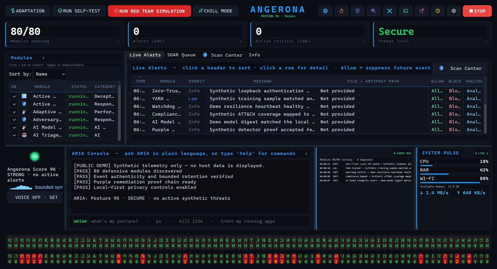

# LinkedIn launch draft — Angerona v1.11.0

Suggested lead image:

Upload the dashboard PNG directly to LinkedIn, then paste the post below.

---

I just finished the biggest defensive hardening pass yet for Angerona Security
Suite: **v1.11.0**.

The quick brag—kept measurable: static discovery now reports **80 Windows
modules, 14 Linux modules, and 13 macOS modules**, backed by a three-round
security, reliability, and performance review. The final serial gate collected
**1,675 tests: 1,670 passed, 5 expected host-capability skips, and 0 failed**.

This update is aimed at the awkward problems that ordinary endpoint dashboards
often flatten into a green check:

• authenticated, loss-aware sensor provenance before evidence can advance trust

• SSH key/tunnel and ordered tradecraft correlation without collecting private
keys, full commands, or raw endpoints

• Windows event-log clear/gap detection plus exact-cohort recovery assurance

• driver, Secure Boot, measured-boot, DMA/IOMMU, Thunderbolt, USB4, and
removable-media posture with UNKNOWN kept honest

• a Personal Sentinel reference authority for a separately administered
intermediate gateway/witness

• signed release authorization, anti-rollback floors, and an OS-validated MSIX
first-install contract

• an 18-entry, digest-pinned ARIA Defense Memory with a one-redacted-excerpt
cloud boundary

• a new Live Defense Activity panel showing sanitized operational events—not
source code or hidden AI reasoning

The philosophy is simple: zero trust for network paths, least privilege for
response authority, independent evidence where possible, and no pretending
that user-mode software is magic.

Realistic limits matter. Angerona is still a local-first home-lab, research,
learning, and portfolio platform—not an independently certified enterprise
EDR/XDR. The Personal Sentinel code is a reference service, not a router
appliance; hardware/whole-host rollback resistance still needs separately
administered infrastructure; and a public Windows build requires a provisioned
publisher identity plus clean-VM validation.

Code, screenshots, capability map, and engineering evidence for v1.11.0:
https://github.com/Ag3nt47/AngeronaSuite/tree/codex/enterprise-cycle7

#CyberSecurity #BlueTeam #DFIR #ZeroTrust #EDR #OpenSource #Python #SecurityEngineering #LocalAI

---

## Shorter alternate

**Angerona Security Suite v1.11.0** is the largest defensive hardening update
I've shipped so far.

Static discovery now reports **80 Windows / 14 Linux / 13 macOS modules**. The
new work adds authenticated sensor provenance, SSH and event-log continuity
defenses, exact-cohort recovery assurance, driver/DMA/measured-boot posture,
Personal Sentinel witness contracts, release anti-rollback controls, a
digest-pinned 18-entry ARIA Defense Memory, and a sanitized Live Defense
Activity dashboard.

It is deliberately honest about limits: local-first and defensive, no
state-actor attribution, no offensive payloads, no router takeover, and no
claim that user-mode software or a local rollback floor defeats a compromised
administrator/kernel.

Final serial validation: **1,670 passed, 5 expected host-capability skips, 0
failed** from 1,675 collected tests.

See the new dashboard and full engineering record:
https://github.com/Ag3nt47/AngeronaSuite/tree/codex/enterprise-cycle7

#CyberSecurity #BlueTeam #ZeroTrust #OpenSource #LocalAI
