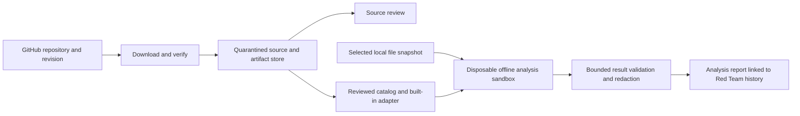

# Red Team: GitHub Tool Library and isolated analysis

Status updated 2026-09-23: source import/review is delivered. The VMware analyzer
backend, pinned catalog, optional setup and report controls are implemented, but
native guest acceptance failed on tested Workstation 25.0.1. Run remains gated.
Runtime stays v1.13.0 with 84 catalog capabilities. The implementation status
below distinguishes shipped controls from the intended design and remaining
acceptance work.

## VMware implementation follow-up

The implementation provides a fixed RAM-only Linux appliance on VMware
Workstation for Windows. Hypervisor discovery checks both Windows registry views
and supports nonstandard installation paths. The appliance creates its own VM
configuration and boot ISO; native checks did not modify or start existing VMs.

The executable catalog pins Gitleaks 8.30.1, Bandit 1.9.4, an Alpine 3.24.1 boot
kernel/root filesystem and exact Python/dependency packages. Preparation validates
all 30 artifact SHA-256 values and the deterministic guest-image digest. Linux
archive paths are encoded into an initramfs, never extracted onto the host.
Only reviewed analyzer entry points run, with project configuration discovery
removed through opaque input filenames and fixed configurations.

The VM has no network adapter, writable virtual disk, host share, clipboard,
drag/drop, USB or 3D acceleration. A readonly boot CD contains its bounded input;
guest scratch data stays in 768 MiB RAM. Output uses a local, user-restricted named
pipe with a 2 MiB host limit. Before analysis, the guest waits for a host handshake:
the pipe peer must be the exact VMX process for this job, and it must enter a
Windows Job Object with one process, 2 GiB committed-memory limit and kill on
close. Guest analyzers run as UID/GID 65534, with no supplementary groups.

Input is limited to 2,000 eligible UTF-8 files, 16 MiB total and 1 MiB per file.
Binary files, linked/reparse paths, virtual environments, dependency directories
and Angerona runtime data are excluded. The report records skipped entries and
Bandit parse errors. Guest output drops secret values, code excerpts, free-form
messages and fingerprints before transport; the host accepts only the fixed
location/rule schema bound to the job, input and catalog. Reports have no response
authority and do not enter native Red Team catch scores.

Analysis Lab now offers Prepare runtime, Check readiness, input/analyzer selection,
Run, Cancel, redacted results/history/export and Clear interrupted jobs. Expensive
work runs outside Qt. Two worker permits and one cross-process analysis lease
bound concurrency. At most two interrupted job directories are retained; cleanup
is constrained to generated UUID job directories and rejects reparse paths.

**Native acceptance has not passed.** The explicitly approved service setup
verified the installed vendor image, set VMware Authorization Service to Manual
and started it. Native observation confirmed Manual/Running. Workstation 25.0.1
then refused the generated VMX with `ERROR_SHARING_VIOLATION` while the host held
its deny-write/delete seal. A read-only configuration setting and bounded direct
VMX experiments also failed. Neither a successful readiness record nor an
analyzer receipt was accepted.

The seal binds exact generated configuration bytes and file identity throughout
supervision and report acceptance. It is not removed to make the VM start.
Explicit readiness checks first retire prior success; failure or cancellation
cannot leave an older green result. Remaining native work requires a reviewed
VMware-compatible custody handoff or another reviewed backend, then passing
Bandit and Gitleaks guest fixtures. Preparation/offline tests are not substitutes.
See [current native evidence](../../analysis/deep-review-20260923/native-acceptance.md)
and [historical implementation evidence](../../analysis/vmware-analysis-lab-2026-09-05.md).

Full Setup now offers an optional VMware helper. It explains the source-analysis
purpose, additional resource requirements and Skip. Opening it changes nothing.
It opens Broadcom's official download process, where an account and compliance
approval may be required; it does not download or silently install VMware.
A selected local installer must pass vendor signature, product and stable-file
checks. Its file and parent custody remain held through interactive UAC/installer
exit. Service configuration is separately confirmed, verifies the exact service
registration/image, and sets only the Authorization Service to Manual/Running.
Neither action starts a VM or establishes Lab readiness. VMware is unnecessary
for ordinary Angerona monitoring, response and GitHub source review.

## Implementation status

**Delivered:** Red Team -> GitHub Tools contains Source, Verification and Analysis
Lab views. Resolve a public GitHub repository's branch, tag or full SHA, inspect
the pinned commit, then import that source snapshot. Browse text, mark it reviewed
or permanently revoke the exact import. Review status never enables execution.
The source-library shortcuts themselves do not install binaries. The separate
Analysis Lab catalog pins reviewed Gitleaks/Bandit artifacts and adapter commands;
those controls remain subject to the native readiness gate above.

The implementation lives in `src/angerona/core/github_tool_catalog.py` and
`src/angerona/gui/github_tools.py`. Imports retain their ZIP bytes in a separate
runtime `github-source-library` with an atomic index and OS single-writer lease.
No archive is extracted. Raw ZIP directory names and entry counts are checked
before the ZIP parser normalizes names or allocates entries. Every member is
streamed through size/CRC checks before publication; browsing checks the stored
archive SHA-256 again. Preview is UTF-8 text only, with inactive markup and
invisible control characters removed.

Current limits: 100 MiB download, 250 MiB expanded, 10,000 entries, compression
ratio 512, 32 imports, 512 MiB cache including interrupted unindexed archives,
and 256 KiB text preview. Acquisition uses public GitHub endpoints directly,
rejects redirects and sends no credentials or ambient proxy configuration.
Network reads have a ten-second socket timeout; phase checks use a 120-second
deadline. Two background-worker permits bound outstanding work across panels.
Cancellation before the index transaction leaves no ready entry; once the tiny
durable save is sealed, the UI reports that it is finishing instead of claiming
cancellation. Closing the console requests cancellation without waiting on I/O.

**Remaining:** native acceptance of enforceable guest configuration custody and
both analyzer fixtures. The implemented supervisor, transport and redacted
history have offline/inert regression coverage; no successful native analyzer
execution is claimed. A dedicated unprivileged acquisition process for elevated
Protect sessions also remains future work. Current acquisition and review
mutations refuse administrator/root sessions. Installing a hypervisor alone
never enables Run, and no host-subprocess analyzer fallback was added.

**Evidence:** the public Bandit source at commit
`1d3053df070c91fe0fde002a21536c277d67e5d9` was imported in an isolated development
data root: 298 files, 4,331,346 archive bytes, README preview successful, no code
executed. Core/UI regression checks use synthetic inert archives and fake network
responses; the UI was rendered at normal and compact sizes. Full validation
results are recorded in `analysis/github-source-review-2026-09-05.md`.

## Product decision

Add **GitHub Tools** to the Red Team console. Operators can import a pinned
repository snapshot for source review, then use a reviewed offline analyzer on
an explicitly selected copy of local files. Keep the existing benign simulation
and Sandbox Editor available alongside the new workflow.

The first executable adapters are **Gitleaks directory analysis** and **Bandit
Python source analysis**. Gitleaks supports local file analysis and redacted
reports; Bandit examines Python syntax trees for security issues. Their exact catalog entries and fixed adapters are implemented; successful
native guest acceptance remains required. Other tools still need individual
review rather than inheriting trust from a repository listing.
[Gitleaks documentation](https://github.com/gitleaks/gitleaks),
[Bandit documentation](https://bandit.readthedocs.io/en/latest/).

Other repositories enter **Review only**. A repository cannot supply its own
execution adapter, installation script or permissions. New runnable tools require
a maintained adapter and a separately reviewed, exact catalog entry. This design
supports defensive analysis and inert simulation content; it does not add exploit
execution, remote target scanning or automated offensive campaigns.

## Existing components and integration

| Existing component | Current behavior | Design integration |
| --- | --- | --- |
| `src/angerona/gui/red_team_console.py` | Run, History, Device Security Lab and Sandbox Editor tabs | Add GitHub Tools and an Analysis Lab view; retain existing drill controls |
| `src/angerona/core/source_sandbox.py` | Guarded copies of allowlisted installed source | Keep the editor's copy-only contract; use a separate import store |
| `src/angerona/core/sandbox_runner.py` | Time-limited subprocess for installed module self-tests | Never use it to isolate downloaded programs; it has no OS-enforced network or filesystem isolation |
| `src/angerona/shark/red_team.py` | Benign marker drills and scoped, reversible test activity | Preserve its validation lease and provenance boundaries |
| `src/angerona/shark/run_manifest.py` | Verified drill history and evidence accounting | Link a separate analysis receipt without treating analyzer output as a detector catch |
| `tools/github_toolkit.lock.json` | Pinned development tools, explicitly outside runtime dependencies | Reuse the pinning concept; create a separate runtime catalog and review process |

The source editor and the new execution sandbox have different guarantees. The UI
must say **Source workspace — edits only** and **Analysis sandbox — isolated run**
where that distinction affects the operator's choice.



## Operator workflow

1. **Import from GitHub.** Enter an HTTPS repository URL and revision. Show the
   resolved commit, owner, repository, license, size and artifact identity before
   import. Public repositories are supported first; private authentication is a
   later, separately scoped addition.
2. **Review imported content.** Browse source as text and see verification
   details. Imported README, AGENTS, workflows and manifests are repository data,
   never instructions to Angerona or authority to run commands. Disable external
   images, active HTML and automatic link opening in previews.
3. **Select an approved analyzer.** A catalog entry names the exact verified tool
   and fixed adapter. Unrecognized tools show Review only with the reason.
4. **Choose analysis input.** Select a local directory, preview exclusions and
   copy its bounded contents to a new job snapshot. Show the source digest and
   file count. Analysis never writes to the original directory.
5. **Run in sandbox.** Show tool identity, input, offline isolation, limits and
   output destination together. Explicit launch authorizes that analysis job;
   importing or viewing a repository does not launch anything.
6. **Review results.** Show findings, tool errors, skipped files and coverage
   limits. Export a redacted report or compare two runs over the same snapshot.

### Console layout

```text
Red Team
Run | GitHub Tools | History | Device Security Lab | Sandbox Editor

GitHub Tools                          [Import from GitHub]
---------------------------------------------------------------
Tool                 Revision       State                 Action
Gitleaks             pinned         Review required       Review
Bandit               pinned         Review required       Review
Imported repository  commit         Review only           Browse

Selected tool
Source | Verification | Analysis Lab | Results

Analysis Lab
Input: selected local copy       Files: count and exclusions
Isolation: offline sandbox      Limits: time, memory, output
Readiness: Ready / exact unavailable prerequisite
                         [Run analysis] [Cancel]
```

This is a layout specification, not a screenshot of an implemented screen. Keep
the action row reachable at the existing minimum window size. Status must include
text and icons rather than relying on color. Downloading, hashing, extraction,
VM startup and result parsing run outside the GUI thread. Use bounded progress
messages, one active analysis job and an always-responsive Cancel control.

## Import and supply-chain boundary

The importer accepts canonical GitHub repository identities, resolves a requested
revision once and records the immutable commit. A branch or tag is a selection
convenience, never the execution identity. Updates create new entries requiring
review; an existing approved entry is immutable.

Downloads use a dedicated, unprivileged acquisition service. Validate every URL
and redirect against the approved GitHub delivery endpoints, enforce TLS, reject
embedded credentials and non-HTTPS schemes, and apply time and size budgets.
Use archive/API retrieval without running Git hooks, submodules, Git LFS helpers,
package managers, build systems or repository setup instructions.

Archives are inert until inspected. Reject traversal, absolute and device paths,
Windows alternate streams, links/reparse points, case-colliding paths, duplicate
entries and unsupported archive types. Bound expanded bytes, file count, nesting
and compression ratio before materializing files. Publish a completed import by
atomic rename inside its guarded, content-addressed store; cancellation leaves
no ready entry. Display non-text content as metadata only.

Runnable catalog entries bind the repository, reviewed source commit, exact
artifact SHA-256, executable and dependency digests, platform, adapter version,
license, review record and revocation status. Expected hashes come from the
reviewed Angerona catalog, not a checksum supplied only by the downloaded archive.
Revalidate bytes and authorization immediately before a run.

Where available, verify upstream build attestations against the expected
repository and build identity. Attestations establish provenance; they do not
establish benign behavior. A missing or failed required attestation leaves the
entry non-runnable. GitHub documents verification of artifact and SBOM
attestations. [GitHub provenance documentation](https://docs.github.com/en/actions/how-tos/secure-your-work/use-artifact-attestations/use-artifact-attestations).

Revocation immediately blocks queued and new jobs. Active jobs using that digest
are cancelled and their reports retain a revoked-tool warning. Cached artifacts
cannot retain authority after the catalog or adapter is revoked.

## Execution isolation

Imported code never executes in Angerona, its virtual environment, a module
self-test worker or its privileged protection broker. The execution backend must
be a disposable VM with enforceable isolation. A directory, Python isolated mode
or ordinary subprocess is insufficient. If the supported backend is unavailable,
retain source review and disable Run with an actionable readiness explanation.

Windows Sandbox is a candidate backend, subject to the acceptance gates below.
Its documented defaults enable networking and clipboard sharing, so a product
profile must explicitly disable them. Microsoft also provides mapped-folder
permissions, memory allocation and Protected Client settings; writable mapped
folders can persist guest changes on the host.
[Microsoft Windows Sandbox configuration](https://learn.microsoft.com/en-us/windows/security/application-security/application-isolation/windows-sandbox/windows-sandbox-configure-using-wsb-file).

Required product profile:

- No network adapter/egress; no clipboard, microphone, camera, printers, GPU or
  host credential forwarding. Require the reviewed backend's isolation settings.
- Only the immutable tool bundle and selected input snapshot enter the guest.
  Never expose the checkout, home directory, live runtime, response journal,
  signing keys, token stores, broker interfaces or whole host drives.
- Offline, digest-locked dependencies accompany the approved bundle. Repository
  plugins, configuration discovery and install/build hooks remain disabled.
- Built-in adapters use fixed operations and typed options. The UI offers no
  arbitrary command, shell, import path or repository-defined entry point.
- Gitleaks uses the selected snapshot and a reviewed configuration with redacted
  results. Bandit uses bundled reviewed checks and a fixed configuration; it
  analyzes source without importing the project being assessed.
- The supervisor binds each sandbox instance to its job, enforces the deadline
  and stops the entire guest on cancellation. A cancelled or interrupted run
  cannot later become successful due to a delayed result.
- Output leaves the guest through a bounded channel into a fresh job-only area.
  No writable production mapping is permitted. Any writable scratch mapping must
  have an enforceable host-side capacity limit before a tool is allowed to run.

Proposed initial budgets: one active guest, two queued jobs, 120 seconds for each
download and extraction phase, 100 MiB compressed download, 250 MiB expanded tool
bundle, 10,000 archive entries, 4 GiB guest memory, five minutes of analysis,
250 MiB input, 10 MiB structured results and 1 MiB retained log text. These are
design limits, not measured performance. Revalidate them with real benign tools
before release; reject over-budget work explicitly.

Windows Sandbox configuration alone does not establish the required output quota,
instance supervision or reliable report channel. Validate these with the backend
prototype; if they cannot be enforced, use a managed disposable VM with bounded
virtual disks. Never fall back to a host subprocess. Do not advertise isolated
execution until these platform gates pass.

## Evidence and action boundary

Store an analysis receipt containing job ID, tool/catalog/adapter identities,
artifact and input digests, isolation profile, timestamps, exit status, limits,
parser version, warnings and result digest. Bind receipts to the host job record;
the guest must not possess Angerona's signing keys or assert native sensor origin.

Parse bounded JSON using a fixed schema. Reject unsupported fields and paths
outside the input manifest. Render text literally, strip control characters and
redact secrets before indexing, logging, exporting or passing summaries to ARIA.
Treat stdout and tool-authored reports as untrusted claims, even for an approved
tool. Disable remote references, HTML execution and automatic file launching.

History identifies these as **External analysis**. A successful process exit
means the analyzer completed; zero findings does not mean the system is secure.
Report skipped files and errors separately from a complete clean result. Findings
may create reviewable development issues or posture observations, but cannot
authorize Combat, terminate a process, quarantine a host file, install a rule or
resolve an active incident. Only the existing independently verified response
path can authorize protective actions.

## Implementation slices

Proposed names below describe future components; they do not claim files exist.

| Slice | Proposed responsibility | Release criterion |
| --- | --- | --- |
| 1. Catalog and review | `core/github_tool_catalog.py`, strict manifest schema, source-only import store, GitHub Tools tab | Import, review, update, revoke and cancel without executing repository content |
| 2. Isolated backend | `core/tool_analysis_jobs.py`, backend supervisor and fixed Gitleaks/Bandit adapters | Offline guest, byte verification, quotas, cancellation and output transport proven with inert fixtures |
| 3. Evidence integration | `core/tool_analysis_reports.py`, Results view and History links | Redacted, bounded receipts; no effect on native drill scores or response authority |

Slice 1 can ship independently as **GitHub source review**. The Run control stays
unavailable until Slice 2 passes on a supported Windows host. Versions and exact
tool artifacts are chosen and verified during implementation, not invented here.

## Acceptance checks

Use synthetic repositories, harmless marker files and fake analyzer adapters for
offline boundary tests. Add opt-in integration checks using the two approved
offline analyzers in the real disposable guest. No exploit pack is required.

| Boundary | Required observation |
| --- | --- |
| Import identity | A moved tag, altered artifact, revoked catalog or stale approval cannot execute |
| Archive handling | Unsafe names, link entries, collisions and expansion overruns are rejected before exposure |
| Instruction handling | Repository prose, workflows and manifests cannot change permissions or invoke commands |
| Adapter surface | Unknown operations, repository plugins and command-like input are rejected |
| Isolation | An inert guest selfcheck cannot reach a local network test endpoint, host canary outside its input, clipboard or production credentials |
| Resource bounds | Oversized output and deadline overruns terminate the job without filling the host disk |
| Cancellation | Cancelling at download, extraction, startup, run or parse leaves no active guest and accepts no late success |
| Evidence | Forged output, malformed reports and secret-bearing text cannot become native detections or leak into exported results |
| UI | Import progress remains responsive; readiness and failures are readable with keyboard navigation and display scaling |
| Regression | Existing benign Red Team drills, source-copy editing, Device Security Lab and response authorization retain their current contracts |

Source review is delivered as described at the top of this document. The remaining
execution design is not an isolation claim or an enabled runtime capability.
